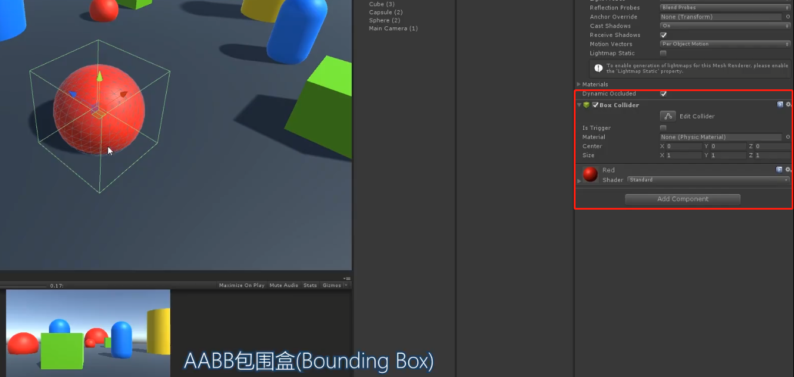
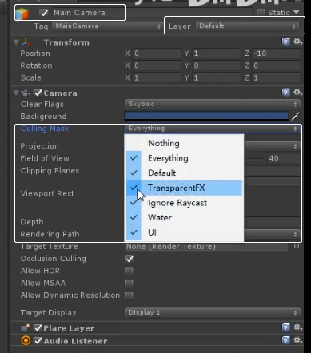
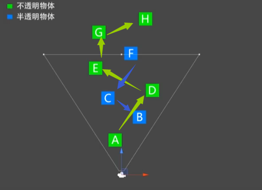
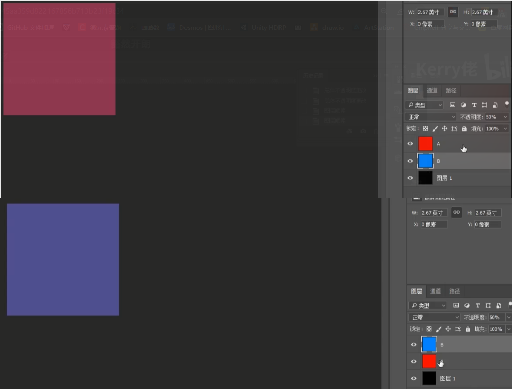

# 1.总体管线：

 

多个相机，每个相机都会跑一遍渲染流程

画出来的如何解决冲突：

clear flags：除了天空盒外的都被清理，选择不清除，两个摄像机结果会迭加起来

Depth：数字越小，越先被渲染。后渲染的相机把前面的相机覆盖掉

# 2.每个步骤做了什么

## 应用程序阶段

### 剔除 Culling

1. 视锥体剔除 **Frustum Culling**

   1.  AABB包围盒：对于表面复杂的网格，做 **碰撞检测** 加上个包围盒

      

2. 层级剔除 **Layer Culling Mask**

   1. 在设置中剔除某一层级中所有的东西
   2. camera中 选择 Culling Mask进行剔除过滤相关物体层级
   3. 

3. 遮挡剔除 **Occlusion Culling**

   1. [遮挡剔除](https://blog.csdn.net/liu_xueping/article/details/123407498)

### 排序 Sort

1. 渲染队列 RenderQueue
2. 不透明队列 RenderQueue < 2500
   1. 摄像机距离 从前到后排序：先前后后，省掉后面的重叠部分
3. 半透明队列 RenderQueue > 2500
   1. 按摄像机距离 从后到前 排序：渲染效果正确性
   2. 但是复杂形状很难保证这个顺序，所以半透明问题很大

ps中不透明顺序结果不同
