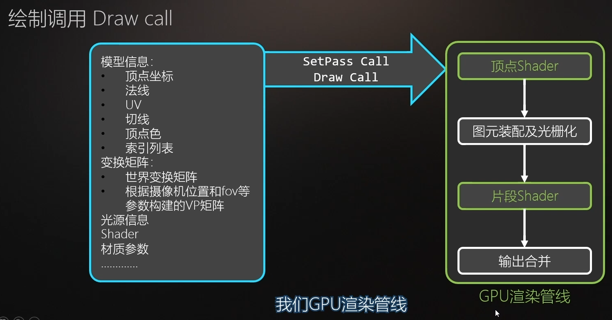
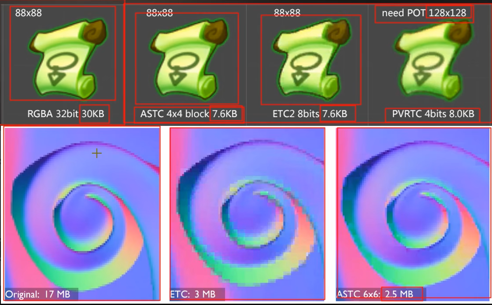

# 1.总体管线：

 

多个相机，每个相机都会跑一遍渲染流程

画出来的如何解决冲突：

clear flags：除了天空盒外的都被清理，选择不清除，两个摄像机结果会迭加起来

Depth：数字越小，越先被渲染。后渲染的相机把前面的相机覆盖掉

# 2.每个步骤做了什么

## 1.CPU应用程序阶段

### 剔除 Culling

1. 视锥体剔除 **Frustum Culling**

   1.  AABB包围盒：对于表面复杂的网格，做 **碰撞检测** 加上个包围盒

      

2. 层级剔除 **Layer Culling Mask**

   1. 在设置中剔除某一层级中所有的东西
   2. camera中 选择 Culling Mask进行剔除过滤相关物体层级
   3. 

3. 遮挡剔除 **Occlusion Culling**

   1. [遮挡剔除](https://blog.csdn.net/liu_xueping/article/details/123407498)

### 排序 Sort

1. 渲染队列 RenderQueue
2. 不透明队列 RenderQueue < 2500
   1. 摄像机距离 从前到后排序：先前后后，省掉后面的重叠部分
3. 半透明队列 RenderQueue > 2500
   1. 按摄像机距离 从后到前 排序：渲染效果正确性
   2. 但是复杂形状很难保证这个顺序，所以半透明问题很大

ps中不透明顺序结果不同，必须严格按照 **从后到前** 的渲染顺序

### 打包数据 Batch

- SetPassCall设置渲染选项，例如：用什么shader，用什么混合模式，设置背面剔除等等，渲染设置
- DrawCall告诉GPU模型数据，开工

## 2. GPU渲染管线

### 1.整体流程

### 2. 顶点Shader

### 3.硬件操作阶段（光栅化阶段）

1. 裁剪操作Clipping 是在前一个 (2* 2 * 1)的裁剪空间基础上裁剪（不是梯形视角）
2. Clipping操作是 将 一个三角形 在外面的顶点剔除，生成新的小三角形，而不是Culling那种将视角外顶点全剔除的操作。
3. 背面剔除：三角形顶点顺时针，行列式为负，则为背面，剔除
   1. 
4. 视口转换：NDC空间转屏幕空间（视口变换）**不操作 Z 坐标**
   1. 
5. 图元装配（将顶点连线，变成三角形）
   1. 前面的操作都是对顶点的操作
6. 光栅化：填充三角形，通过Z坐标插值，对重合的点进行深度插值（还有各种顶点色插值等）
   1. 
   2. 线性插值
      1. 
   3. 逐行扫描
      1. 
      2. 扫描线算法光栅化
         1. 
      3. 光栅化结束，下个阶段：每个片元，调用一次片元Shader
         1. 

### 3. 片元Shader

最重要任务：上色

1. 纹理技术
   1. 纹理采样（真实公式不是这样）
      1. 
   2. 纹理过滤机制
      1. 
      2. 临近点四舍五入等操作，会让小图放大失真
      3. 
      4. 双线性插值效果会柔和很多
      5. Unity中在 `filter mode`中选择
      6. 
   3. Mipmap，占用更多显存，1+0.5+0.25+0.125+0.0625…………收敛于 2
      1. 
      2. 
   4. 纹理寻址模式 如果uv超过了 限制咋办 （比如1,1uv范围传进来2，2）
      1. 
      2. Warp mode 设置
      3. 
   5. 纹理压缩格式
      1. PNG，JPG，TGA这些图片压缩，是不用在游戏中的
      2. 会转换到各个平台的图片压缩格式
         1. PC：DXT，BC，无损RGBA 32bit，ASTC（新）
         2. 安卓常用：ETC2
         3. 苹果老压缩格式：PVRTC，必须要图片尺寸 2的幂次方 正方形
      3.  
2. 光照计算
   1.  
   2. 
   3. 漫反射是 光线 和 法线 的夹角（cos）
      1. 
   4. 镜面反射是 摄像机 和 出射光 方向的夹角（cos）
      1. 
   5. 环境光 
      1. 
      2. 环境光是间接光照，有几种模拟技术
      3. Lightmap
      4. Reflection Probe反射球：基于图像的照明（IBL Image Based Light）实现镜面反射的环境光
      5. Light Probe 球协光照SH，实现低频 漫反射 环境光
   6. 
   7.  
      1. 直接光漫反射：phone
      2. 直接光镜面反射：PBR的GGX高光方程
      3. 间接光漫反射：球协光照SH
      4. 间接光镜面反射：反射球，捕捉周围环境
      5. 

### 4. 输出合并阶段

片元数据：Color，Alpha，Depth

1. Alpha测试：Alpha低于某个值，直接丢弃   一般用于树叶镂空
2. 模板测试
3. 深度测试，用depth，看谁靠前，渲染谁
4. 混合：也可以前后都渲染，看混合公式如何做
5. 帧缓冲区
   1. 
   2. 
   3. 深度测试
      1. 
      2. 深度写入，
         1. 不让写的话，上面的一排，Z-buffer不会写入值，
         2. 通过了深度测试，
         3. 也不刷新深度缓冲区，一直是初始状态
         4. 不影响下面的颜色缓冲区写入
      3. 深度测试
         1. 设定新的规则，比如当前深度值 一定比帧缓冲深度 大才能通过（shader中设置）
      4.  有的管线是这个顺序，其实更快，只不过有的机器不支持
         1. 
   4. 混合Blending
      1. 

