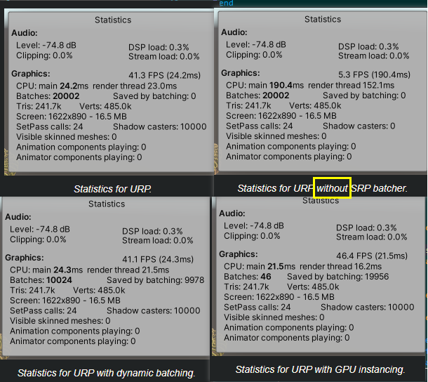
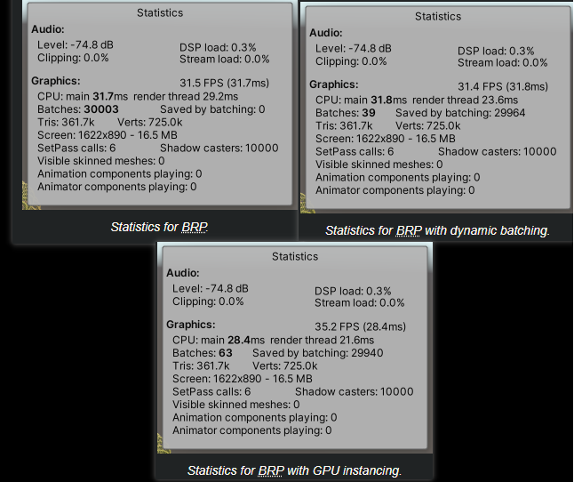
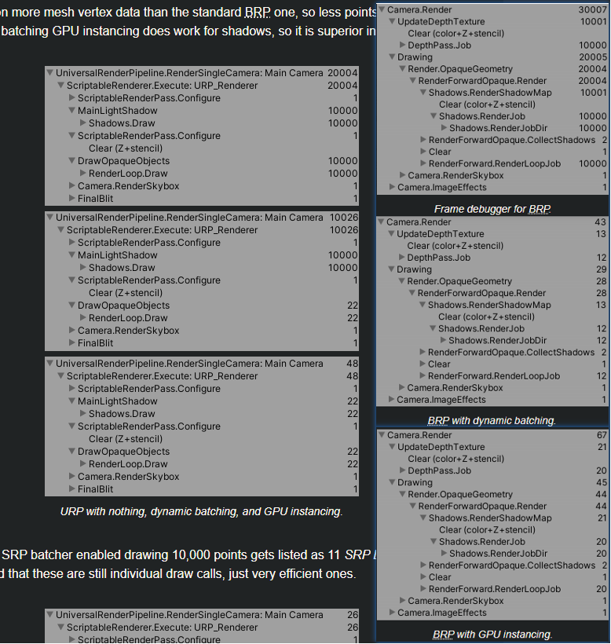
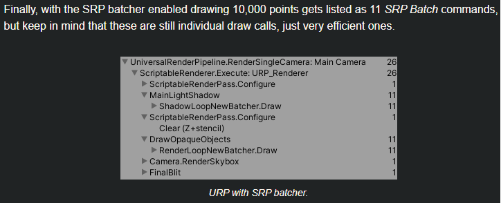
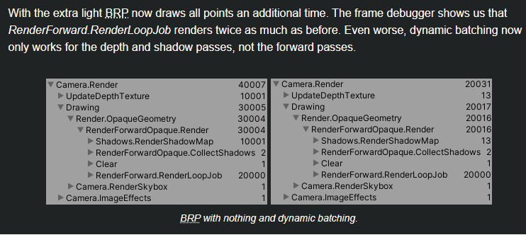
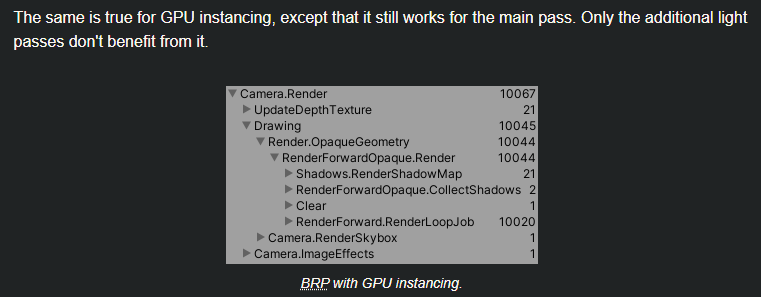
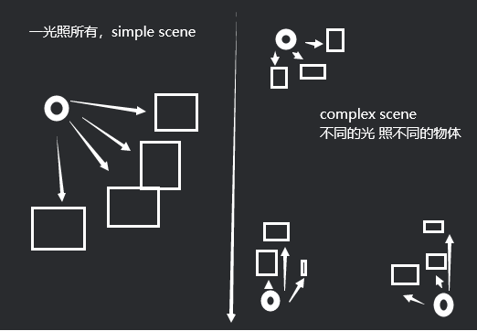
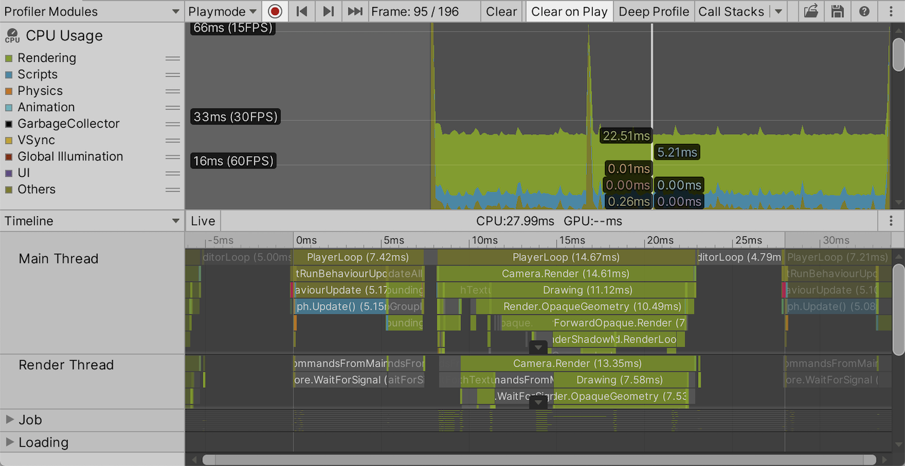
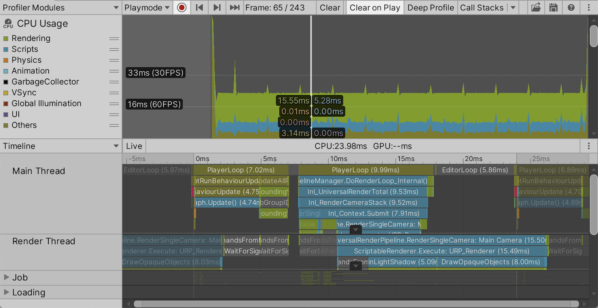
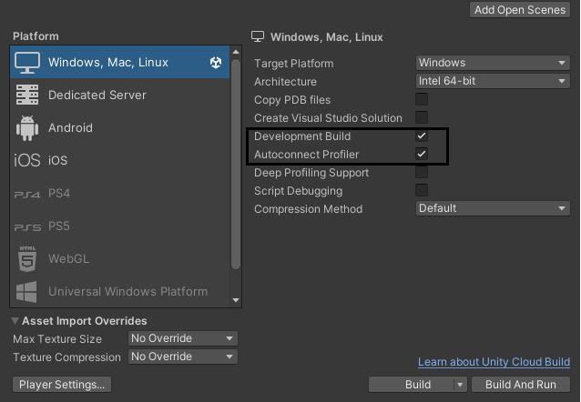

# 4. measuring Performance

https://catlikecoding.com/unity/tutorials/basics/measuring-performance/

## 本例性能优先级

文中实例，URP GPU Instancing > dynamic batching和SRP batcher但是相差很小



**Note****：** **GPU Instancing** **和** **SRP batcher****不能同时使用**

- GPU Instancing复用网格和材质等GPU资源 减少绘制调用次数
- SRP batcher批处理可合并的渲染状态（相同材质，网格，光照等）减少CPU 和GPU 开销
- 启用了SRP Batcher时，Unity会自动将所有的对象进行批处理
- 并使用自动生成的材质进行渲染
- 这个过程中，Unity会对每个批次的对象进行状态合并和排序等操作
- 由于GPU Instancing需要单独设置每个Instance的变换矩阵等参数，与SRP Batcher的批处理方式不兼容，因此就无法同时使用。

## Frame Debugger

BRP三个 **DepthPass.Job**  **Shadows.RenderDirJob**  **RenderForward.RenderLoopJob**



- dynamic batching 不适用于阴影贴图，所以对urp影响较小
- GPU Instancing 适用于阴影，所以在这个例子，效果好于dynamic batching



SRP batcher大大减少了CPUGPU的通信

## 额外光 

加一个额外点光源



- RenderForward.RenderLoopJob 和之前一样
- 因为dynamic batching应用于 **深度** 和 **阴影** 不用于**前向渲染**



第二个光源在URP里面 命令列表 不会有不同，尽管GPU每次绘制要做更多计算

**以上结论仅用于** **单个光源作用于所有点，**若是 不同光源 分别照射不同点，事情会变得复杂

当使用GPU Instancing时，批次可能会被拆分，**导致以上结论对复杂场景不一定成立**如下图



## forward deferred rending

1. forward rending

   1. 传统，对每个像素 多次计算来实现光照，每个光源都要对每个像素进行处理

      多个光源和多个物体时，性能很差

      但是可提供透明效果，

      移动设备较好性能

2. deferred rending 延迟渲染

   1. 缓存减少光照计算，

      先绘制一个几何图形缓冲区（**G-buffer**）包含深度、法线、颜色等信息

      在光照处理阶段中，对于场景中的每个光源都会进行单独的计算，

      并将 计算结果 与 之前绘制的几何图形缓冲区 进行合成，最终生成最终的图像。

      因为只需要处理屏幕上**可见的像素和光源**，而无需对整个场景进行多次处理，

      所以相比前向渲染，延迟渲染可以更高效地处理大量物体和多个光源。

## Profiler





每一真PlayerLoop，其中大部分时间都花费在调用RunBehaviourUpdate上，

主要是由我们的Graph.Update方法调用导致的。

## Profiling a build

编辑器会消耗一部分性能，所以为了排除编辑器带来的性能损耗，可以直接如下设置来看profiler



## 打印帧数

```c#
using System;
using System.Collections;
using System.Collections.Generic;
using TMPro;
using UnityEngine;
using TMPro;
    
public class FrameRateCounter : MonoBehaviour
{
    [SerializeField] private TextMeshProUGUI display;
    
    // 表示几秒范围内平均帧数，间隔 samleDuration 秒刷新一次
    [SerializeField, Range(0.1f, 2f)] private float sampleDuration = 1f;
    
    private int frames;

    private float duration;
    
    // Start is called before the first frame update
    void Start()
    {
    }

    // Update is called once per frame
    void Update()
    {
        // 通常使用 Time.deltaTime 来控制游戏物体的移动、旋转、变换等操作
        // 对于涉及到物理模拟和游戏逻辑相关的操作，建议使用 Time.deltaTime
         
        // 不同于 Time.deltaTime，
        // 不受时间缩放影响的变量，表示上一帧和当前帧之间的真实时间（以秒为单位
        // 血条的渐变动画、粒子效果的生命周期等需要使用这个
        float frameDuration  = Time.unscaledDeltaTime;

        frames += 1;
        duration += frameDuration;

        if (duration >= sampleDuration)
        {
            display.SetText("FPS\n{0:0}\n{1:0}\n000", frames / duration);

            //如果大于设定的秒数，就清零（其实就是计算sampleDuration秒平均帧数）
            frames = 0;
            duration = 0f;
        }
    }
}
```

## Best and Worst

显示最高最小帧数

```c#
using System;
using System.Collections;
using System.Collections.Generic;
using TMPro;
using UnityEngine;
using TMPro;
    
public class FrameRateCounter : MonoBehaviour
{
    [SerializeField] private TextMeshProUGUI display;
    
    // 表示几秒范围内平均帧数，间隔 samleDuration 秒刷新一次
    [SerializeField, Range(0.1f, 2f)] private float sampleDuration = 1f;
    
    private int frames;

    // 最佳持续时间设置为float.MaxValue，这是最坏的最佳持续时间
    float duration, bestDuration = float.MaxValue, worstDuration;
    
    // Start is called before the first frame update
    void Start()
    {
    }

    // Update is called once per frame
    void Update()
    {
        // 通常使用 Time.deltaTime 来控制游戏物体的移动、旋转、变换等操作
        // 对于涉及到物理模拟和游戏逻辑相关的操作，建议使用 Time.deltaTime
         
        // 不同于 Time.deltaTime，
        // 不受时间缩放影响的变量，表示上一帧和当前帧之间的真实时间（以秒为单位
        // 血条的渐变动画、粒子效果的生命周期等需要使用这个
        float frameDuration  = Time.unscaledDeltaTime;

        frames += 1;
        duration += frameDuration;
        
        if (frameDuration < bestDuration) {
            // 一帧运行的时间 比好的情况短 说明是更好的情况 作为分母小
           bestDuration = frameDuration;
        }
        if (frameDuration > worstDuration) {
            // 一帧运行的时间 比好的情况长 说明是更坏的情况 作为分母大
            worstDuration = frameDuration;
        }
        if (duration >= sampleDuration) {
            display.SetText(
                "FPS\n{0:0}\n{1:0}\n{2:0}",
                1f / bestDuration,
                frames / duration,
                1f / worstDuration
            );
            frames = 0;
            duration = 0f;
            bestDuration = float.MaxValue;
            worstDuration = 0f;
        }
    }
}
```

## Frame Durations

帧率是衡量性能的一种好单位，但当尝试达到目标帧率时，显示每帧持续时间更有用。

## Looping Through Functions

## Interpolating Functions

用插值，平滑过渡

## Transitioning

函数之间的过渡期 添加一个持续时间

# 5. Compute Shader

### 1.2 GPU Graph

- Sorting, batching, and then sending **transformation matrices** for 40,000 points to the GPU takes a lot of time
- 一个变换矩阵，16个浮点数，一个 4字节，一共64B
- 如果是40000个点，则需要2.56million bytes，2.44MB，每次绘制都会将其拷贝到GPU
- URP一帧做两次，一次是 shadow，一次是regular geometry
  - regular geometry（常规几何体）指的是场景中的普通游戏对象和模型。它们包括了所有通常遵循基本光照、反射和阴影计算规则的物体。
  - 通常会被处理为不透明或半透明的表面。
  - 对于不透明物体，URP执行基本的光照和阴影计算；
  - 而对于半透明物体，URP会根据其透明度考虑混合和其他特殊效果。

1. 若是将 点 的 position 放在GPU，则会大大降低CPU GPU之间的通信

#### 创建缓存 ComputeBuffer 

1. A compute buffer contains arbitrary untyped data.一个计算缓冲区包含任意 无类型数据
2. 二参：我们需要传入精确的 元素大小 3个浮点数： 3 * 4字节
3. The object do not survive hot reloads,不能在热加载中生存
   1. 当我们修改代码，在play mode中，他就会消失disappear
4. replace OnEnable to Awake，保证热重载，数据存活
   1. OnEnable会在 Awake之后立即执行，早于Start，在初始化组件是启用状态时
   2. 若没有启用，就只执行Awake

```c#
ComputeBuffer positionsBuffer;
    void OnEnable () {
        // 3个数xyz表坐标，4字节float
        positionsBuffer = new ComputeBuffer(resolution * resolution, 3*4);
    }
    private void OnDisable()
    {
        // release buffer 释放显存
        positionsBuffer.Release();
        positionsBuffer = null;
    }
```


