[高清彩图](https://blog.csdn.net/Raymond_King123/article/details/115661077)

# 第三章 Unityshader基础

## 3.1 unity shader概述

### 3.1.3 unity 中的shader

unity shader与之前提及的渲染管线的shader很大不同。

Unity提供了四种模板

1. Standard Surface Shader：产生一个包含 标准光照模型，使用unity5新加的基于物理的渲染方法 的 表面着色器模板。
2. Unlit Shader：产生不包含 光照 （但包含雾效）的基本 顶点 片元着色器
3. Image Effect Shader：实现各种屏幕后处理效果 基本模板
4. Computer Shader：特殊shader，用GPU进行常规渲染流水线无关的计算（本书不讨论）

Unity Shader必须和材质Material结合起来

## 3.2 Unity Shader的基础ShaderLab
- ShaderLab是Unity提供的Unity Shader说明性语言
- 使用嵌套在花括号内部的语义（Syntax）没教书Unity Shader文件的结构
- 会根据使用的平台将这些结构，编译成真正的代码和Shader文件。

```
Shader "ShaderName"{
	Properties{
		//属性
	}
	SubShader{
		//显卡A使用的子着色器
	}
	SubShader{
		//显卡A使用的子着色器
	}
}
```

## 3.3 UnityShader的结构

### 3.3.2 材质 Material 和 UnityShader的桥梁：Properties

[ShaderLab: defining material properties](https://docs.unity3d.com/Manual/SL-Properties.html)

|     **Type**     | **Example syntax**                                           | **Comment**                                                  |
| :--------------: | :----------------------------------------------------------- | :----------------------------------------------------------- |
|   **Integer**    | `_ExampleName ("Integer display name", Integer) = 1`         | 真正的整形Integer，不像Int是用浮点实现的。<br>为了兼容性可以使用Int |
| **Int** (legacy) | `_ExampleName ("Int display name", Int) = 1`                 | 只是为了兼容性，浮点实现。若整形用**Integer**                |
|    **Float**     | ` _ExampleName ("Float display name", Float) = 0.5`<br> `_ExampleName ("Float with range", Range(0.0, 1.0)) = 0.5` | 浮点，Range可以表示一个拉动条                                |
|      **2D**      | `_ExampleName ("Texture2D display name", 2D) = "" {}` <br> `_ExampleName ("Texture2D display name", 2D) = "red" {}` | 下值放在字符串中使用unity内置纹理<br>“white” (RGBA: 1,1,1,1),<br> “black” (RGBA: 0,0,0,1),<br> “gray” (RGBA: 0.5,0.5,0.5,1),<br> “bump” (RGBA: 0.5,0.5,1,0.5) ,<br> “red” (RGBA: 1,0,0,1).<br>不写默认“gray”.  **Note:** 这默认纹理在 Inspector不可见 |
|   **2DArray**    | `_ExampleName ("Texture2DArray display name", 2DArray) = "" {}` | For more information, see [Texture arrays](https://docs.unity3d.com/Manual/class-Texture2DArray.html). |
|      **3D**      | `_ExampleName ("Texture3D", 3D) = "" {}`                     | 默认“gray” (RGBA: 0.5,0.5,0.5,1) texture.                    |
|     **Cube**     | `_ExampleName ("Cubemap", Cube) = "" {}`                     | 默认“gray” (RGBA: 0.5,0.5,0.5,1) texture.                    |
| **CubemapArray** | `_ExampleName ("CubemapArray", CubeArray) = "" {}`           | See [Cubemap arrays](https://docs.unity3d.com/Manual/class-CubemapArray.html). |
|    **Color**     | `_ExampleName("Example color", Color) = (.25, .5, .5, 1)`    | 颜色选择器float4类型<br> 若想编辑四个单独浮点数，可用Vector类型 |
|    **Vector**    | `_ExampleName ("Example vector", Vector) = (.25, .5, .5, 1)` | float4类型，若想用颜色用Color                                |

- Int Float Integer Range 都是数字类型，Color，Vector 默认值用 ( ) 中的四维向量
- 2D, 3D, Cube是三种纹理值，用一个 字符串 和后面的 花括号 制定， 一般为内置的纹理名称"red"等
  - 花括号用于 指定**纹理属性**， unity5.0后需要自己在 顶点着色器 编写计算相关 **纹理坐标** 的 代码

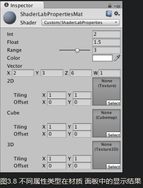

Properties 是为了让这些属性出现在材质面板中（补图）

### 3.3.3 重量级成员：SubShader

- 每个UnityShader文件可以包含多个SubShader语义块，至少一个。
- 需要加载的时候扫描每个SubShader 选择第一个可在 **目标平台** 上运行的SubShader。根据不同显卡进行不同的复杂度计算
- 都不支持的话，Unity使用Fallback语义指定的UnityShader
```c#
SubShader{
	//可选的
	[Tags]
	[RenderSetup]
	Pass{	}
}
```
1. SubShader定义了一系列Pass 和 可选的 **状态**`[RenderSetup]`和 **标签**`[Tags]`
2. 每个Pass定义了一次完整的渲染流程，过多的Pass造成渲染性能下降
3. RenderSetup 和 Tags同样可以在 Pass中声明，在RenderSetup和Tags中设置的可用于所有Pass

 #### 状态设置 RenderSetup

渲染状态设置指令，可以设置显卡各种状态

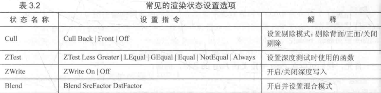

若写在RenderSetup中，则应用到所有的Pass，若不想如此，可以在**Pass中单独设置**

#### 标签 Tags

- Tags是一个键值对，key和value都是字符串string类型
- 告诉渲染引擎 希望 **怎样 何时** 渲染这个对象
- 类似：`Tags{ "TagName1" = "Value1" }`

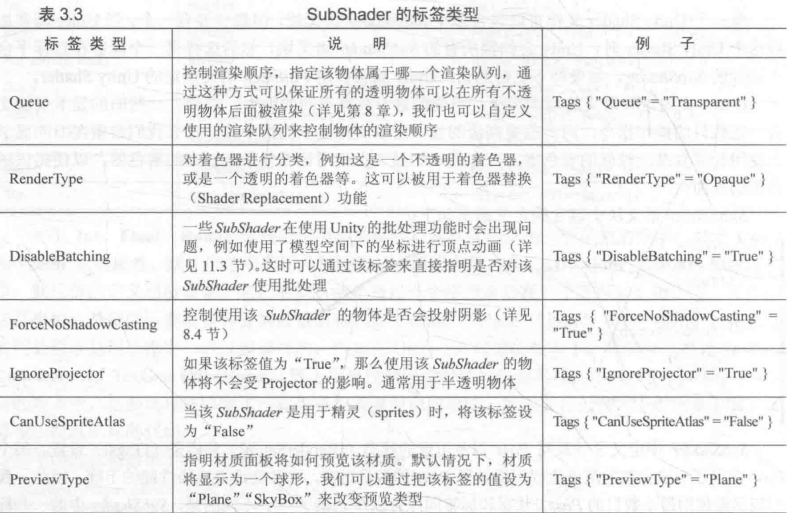

- **上述Tags 仅可以在Sunshader声明， 不可以在Pass中声明！**
- **Pass中也可以声明标签，但是不同于SubShader的标签类型**

#### Pass
```
Pass{
	[Name]
	[Tags]
	[RenderSetup]
	// other code
}
```
1. 先在Pass中定义 Pass 的名称 `Name “MyPassName”`：
   1. 通过Name，可以直接用其他的Shader的Passs，`UsePass “MyShader/MYPASSNAME”`
   2. **Unity会把所有的Pass名称转为大写，一定要用大写**
2. Pass可以设置渲染状态 **RenderSetup**,除了上面的状态设置外,还可以用 固定管线的着色器(3.4.3)命令
3. Pass还可以设置标签**Tags**，不同于SubShader的标签。 但也是用于告诉渲染引擎，怎样渲染该物体的
   1. 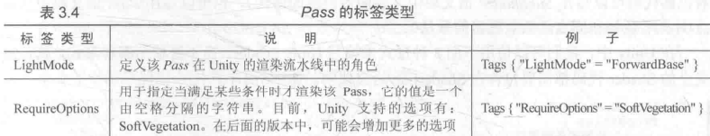

4. UnityShader还支持特殊Pass，用于代码复用或者更复杂效果
   1. **UsePass**：复用其他Shader 的Pass
   2. **GrabPass**：改Pass负责抓取屏幕，并将结果存储在一张纹理中，后续的Pass处理（详见10.2.2）


### 3.3.4 后路：Fallback

- 一个Shader的所有SubShader都运行不了，就用这个 Fallback
- `Fallback “name"`或`Fallbcak Off`
- Fallback还会影响阴影的投射，
  - 在**渲染阴影纹理**的时候，unity会在每个Shader中找到一个阴影投射的Pass
  - 一般，我们不需要 专门实现一个Pass，因为Fallback包含了一个通用的Pass
  - 因此为每个Shader设置正确的Fallback很重要，详见9.4节

自定义材质面板的编辑界面，可以使用CustomEditor扩展编辑界面

## 3.4 Unity Shader的形式

- UnityShader最主要的工作还是指定**各种着色器**的代码。
- 可以写在 SubShader中（表面着色器）
- 可以写在Pass 块中（顶点/片元着色器 和 固定函数着色器做法）

###  3.4.1Unity宠儿 ：表面着色器 SurfaceShader

1. 这是Unity自造的着色器，可以当做一种 顶点/片元着色器的高层抽象
2. 为我们处理了很多光照细节

```C#
Shader "Custom/Simple Surface Shader"{
	SunShader {
		Tags{ "RenderType" = "Opaque"}
		CGPROGRAM
		#pragma surface surf Lambert
		struct Input {
			float4 color : COLOR;
		};
		void surf (Input IN, inout SurfaceOutput o){
			o.Albedo = 1;
		}
		ENDCG
	}
	Fallback "Diffuse"
}
```

- 表面着色器定义在SubShader 的 CGPROGRAM和 ENDCG之间
- 因为，Surface Shader不需要关心用多少个Pass，每个Pass如何渲染，Unity为我们做好
- CGPROGRAM 和 ENDCG 之间的代码是使用CG/HLSL编写的

### 3.4.2 最聪明的孩子：顶点/片元着色器

Unity中可以使用CG/HLSL语言编写顶点/片元着色器（Vertex/Fragment Shader)

```C#
Shader "Custom/Simple Surface Shader"{
	SunShader {
        	Pass{
                	CDPROGRAM
                        #pragma vertex vert
                        #pragma fragment frag
                        float4 vert(float4 v : POSITON) : SV_POSITION{
                        	return mul {UNITY_MATRIX_MVP, v};
                        }
                	fixed4 frag() : SV_Target {
                        	return fixed4(1.0, 0.0, 0.0, 1.0);
                        }
                        ENDCG
            }
	}
}
```

1. Surface Shder一样，Vertex/Fragment 也要定义在`CGPROGRAM` 和 `ENDCG`之间
2. 不同：Vertex/Fragment**要写在Pass**语义块中，而不是SubShader中

### 3.4.3 被抛弃的角落： 固定函数着色器 Fixed Function Shader

对于老旧设备，GPU仅支持DirectX7、OpenGL 1.5 或者OpenGL ES 1.5，例如iPhone3**不支持可编程管线Shader**，需要用到

```C#
Shader  "Tutortial/Basic"{
	Properties{
		_Color {"Main Color". Color} = {1, 0.5, 0.5, 1}
	}
	SubShader{
		Pass{
			Material{
				Diffuse { _Color }
			}
			Lighting On
		}
	}
}
```

Fixed Function Shader定义在 Pass 语义块，相当于一些渲染设置，我们需要完全使用ShaderLab语法编写

### 3.4.4 选择UnityShader形式的建议

1. 如果是 **光源**打交道，推荐表面着色器 Surface Shader
2. 如果是 光源少，例如只有一个平行光，推荐 顶点/片元着色器Vertex/Fragment Shader
3. 如果有更多 **自定义效果**，推荐使用 顶点/片元着色器Vertex/Fragment Shader

## 3.6 答疑解惑

### 3.6.1 UnityShader != 真正Shader 

UnityShader（ShaderLab）我们可以做到的远多于 一个 传统Shader

|                          传统Shader                          |                    UnityShader(ShaderLab)                    |
| :----------------------------------------------------------: | :----------------------------------------------------------: |
|         仅可编写特定Shader，如顶点着色器，片元着色器         |           一个文件中同时包含顶点着色器，片元着色器           |
| 无法设置一些渲染设置，如是否开启混合，深度测试等<br>是另外代码设置的 |                   通过一行特定指令即可设置                   |
|    冗长代码设置**输入输出**，小心处理输入输入位置对应关系    | 只需要特定语句块声明一些属性，便可依靠材质方便改变这些属性<br>对于模型自带的数据（顶点位置，纹理坐标，法线的等）提供直接访问的方法 |

### 3.6.2 UnityShader和CG/HLSL关系

- 通常CG代码是位于Pass语义块中的

- 但是，之前说讲 **表面着色器SurfaceShader**的时候，说CG是写在**SubShader**中的

  - 因为 表面着色器 会转化成 包含多个Pass的 顶点/片元着色器，以用于多种设备
  - 我们可在导入设置面板上点击 *Show Generated Code*看到生成的真正的 顶点/片元着色器 代码
  - 本质上，UnityShader只有两种形式，<u>**顶点/片元着色器**</u> 和 固定函数着色器(5.2后也会被转化为前者)

# 第四章 Shader所需的数学模型

  ## 4.2笛卡尔坐标系

  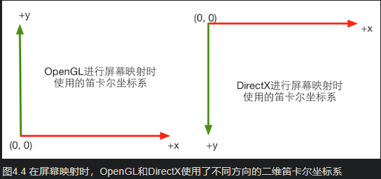

  二维笛卡尔坐标系之间转换：1. 顺时针转180°，此时y轴方向一致，x轴方向相反。2.

1. 三维笛卡尔坐标系定义了3个坐标轴 和 1个原点
   1. 3个坐标轴是 **基矢量（basis vector）**，相互垂直，长度为 1
   2. 这种 **基矢量**被称为 **标准正交基（orthonormal basis）**
   3. 在一些坐标系中，坐标系之间相互垂直但是 长度不是 1 ，这种基矢量被称为 **正交基（orthogonal basis）**
   4. **正交**：相互垂直
2. 因为坐标轴的方向不固定，所以导致了两种不同的坐标系：**左手坐标系（left-handed coordinate space）**和**右手坐标系(right-handed coordinate space)**

### 4.2.3 左手坐标系和右手坐标系

- 对三维笛卡尔坐标系，靠二维的顺时针180°后水平翻转，不能让坐标系重合
- 三维坐标系，我们令两个坐标轴重合，第三条指向总是相反的。这种的就是不同的**旋向性（handedness）**
- Games101记忆更好记住，从X 握到 Y，大拇指指着 Z

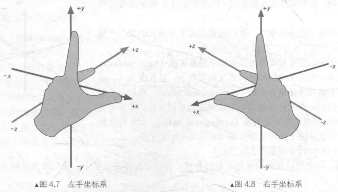

- **旋转的正方向：**用左手右手定则，确定旋转的正方向，大拇指指向旋转的轴正方向，四肢弯曲为正方向
  - 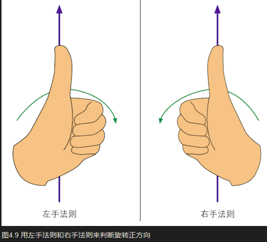

- 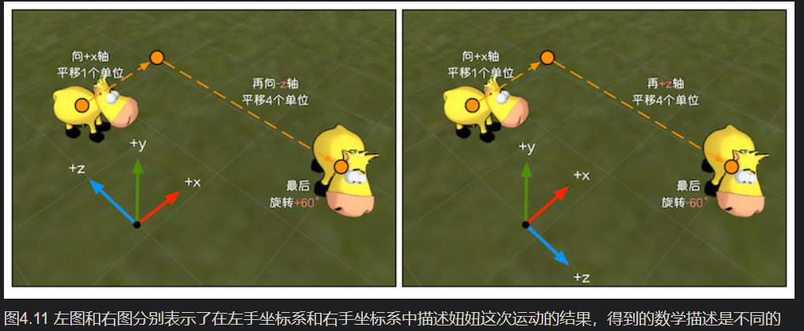

  - 相同的视觉现象，数学描述却是不同的

  - | 左手坐标 | X轴 +1 | Z轴 -4 | 旋转60°   |
    | -------- | ------ | ------ | --------- |
    | 右手坐标 | X轴 +1 | Z轴 +4 | 旋转-60度 |

  -  大拇指指向Y轴，握拳看旋转正反

### 4.2.4 Unity使用的坐标系

1. Unity使用的是**左手坐标系（left-handed  coordinate space）**
2. 但是观察空间，用到是**右手坐标系（right-handed coordinate space）**，摄像机前面方向是 **-Z轴**，与模型空间和世界空间相反，Z轴减少意味着场景深度增加（看绝对值就行）
3. 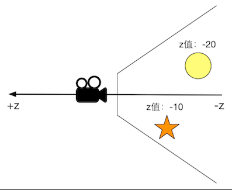

### 4.2.5练习

1. 3dMax的：X正指向右，Y指向前，Z指向上，什么坐标系？
   1. 右手坐标系，大拇指x，食指y，中指z。从x握拳到z，大拇指指y轴
2. 左手坐标西，有一点(0,0,1)，绕y轴正方向旋转+90°，坐标多少？右手呢
   1. 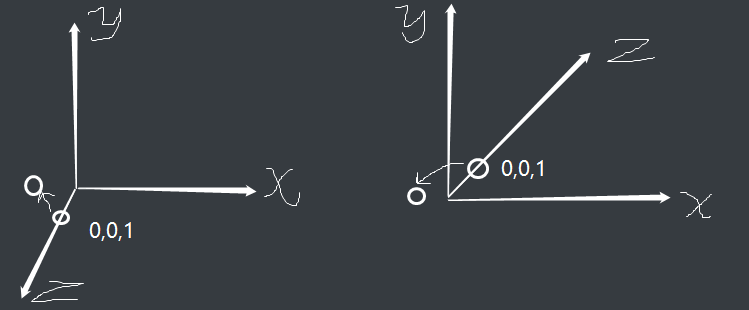
   2. (-1, 0, 0)
3. 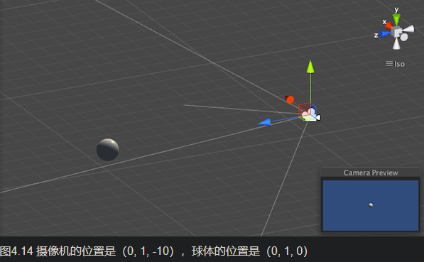
   1. 摄像机观察空间中，球体Z值是：10
   2. 摄像机模型空间下，球体Z值是：-10

## 4.3 点和矢量

- **点(Point)**，N维度空间中的一个位置，没有大小，宽度概念。
- **矢量(vector)**，为了和**标量(scalar)**区分，指<u>n维空间中包含**模(magnitude)**和**方向(direction)**的有向线段</u>。
  - 矢量通常被用于表示一个点的**偏移(displacement)**，是**相对量**，
  - 所以<u>**模和方向不变，无论放在哪里，都是同一个矢量**</u>

### 4.3.2 矢量运算

#### 1. **矢量标量乘除**

1. 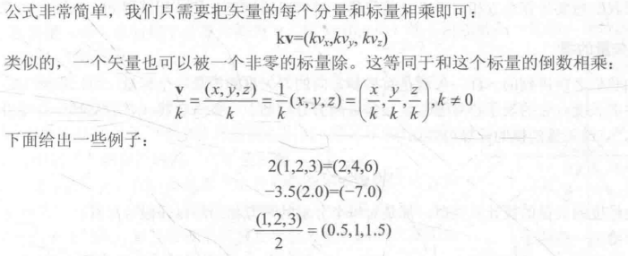

#### 2. **矢量加减法**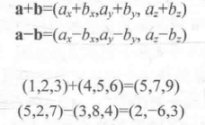

   1. 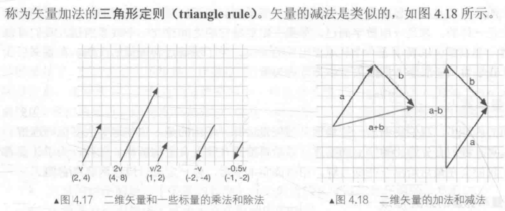
   2. 如果我们想要计算**点b对点a**的位移，就可以通过**b-a**得到

#### 3. **矢量的模**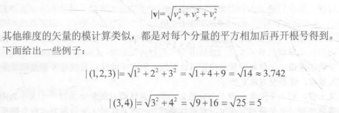

#### 4. **单位矢量（unit vector）**：模为1的矢量，表示我们只关心**方向（direction）**

   - 例如计算光照模型是，得到顶点的法线方向和光源方向

   - 单位向量也被称为**归一化向量（normalized vector）**，对于非零向量，转化为单位向量的过程就叫归一化

   - **归一化**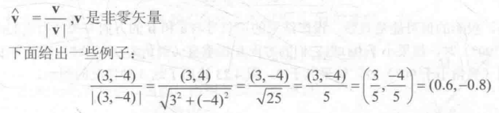
   - 零向量：v=(0,0,0)，不可以被归一化
   - 几何意义：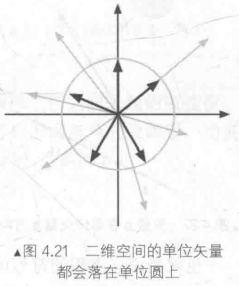
   - 当我们遇到**法线方向**，**光源方向**等，这些不一定是单位向量，在使用前应当**归一化运算**

#### 5. **矢量的点积（dot product）内积（inner product）**

   1. $ a · b = (a_x, a_y, a_z) · (b_x, b_y, b_z) = a_x b_x+ a_y b_y+ a_z b_z $

   2. 点积**几何意义**：**投影（projection）**

   3. 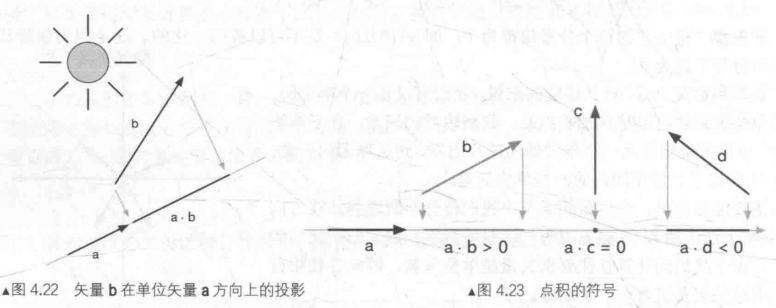

   4. 点积结果的符号让我们知道两个矢量的方向关系：计算两个向量的夹角

   5. 性质

      1. 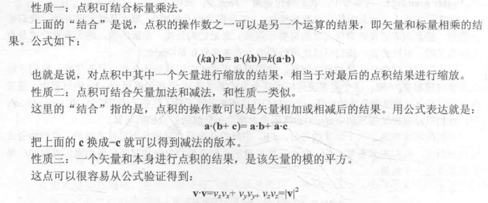
      2. 从性质三，**我们可以用叉积计算<u>模</u>**，一般，我们只想比较**<u>模</u>**大小，就不必开平方消耗性能了

   6. 点积公式二：从三角代数出发，更具有几何意义

      1. $ 公式： a · b = |a||b| \cos \theta  $
      1. 从单位向量 $\hat{a} · \hat{b}  = \cos\theta= \frac{直角边}{斜边}$ 
      1. 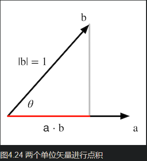
      1. 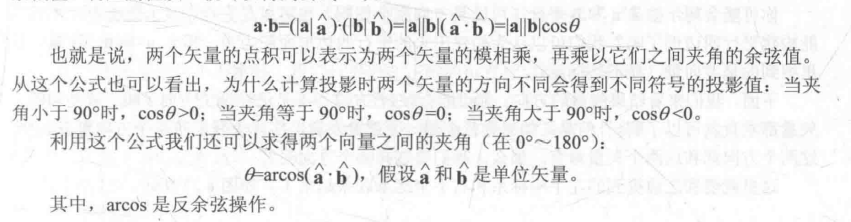
      1. $arcos$反余弦可求两个向量之间的角度

#### 6. 矢量的叉积（cross product）外积（outerproduct）

1. 叉积结果是一个向量(vector)公式如下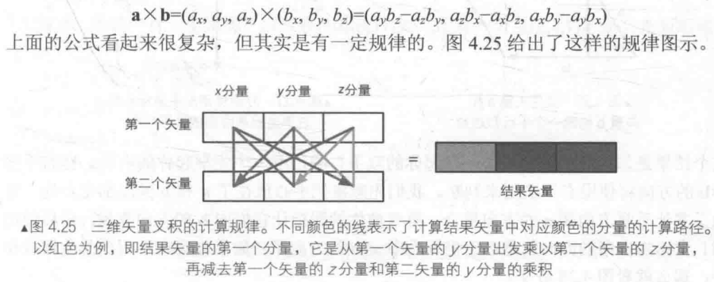
   1. 叉积不满足交换律$a \times b \neq b \times a$，
   2. 不满足结合律$a \times (b \times c) \neq (a \times b) \times c$
   3. 但是满足**反交换律** $a \times b = -(b \times a)$
   4. **几何意义：**两个矢量叉积结果=**垂直**这两个矢量的新向量
      1. ==新向量的模==：$ |a \times b = |a||b| \sin\theta$ （使用正弦sin）
      2. 等价于平行四边形的面积公式：$S_{平行四边形}=|b|h= |b|(|a|\sin\theta) = |a||b|\sin\theta = |a \times b|$
      3. 如果$a和b$ 平行，那么$a \times b = 零向量$ <u>得到零向量，不是0</u>
      4. 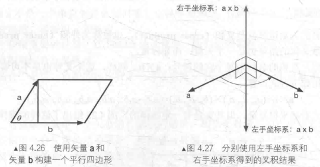
      5. ==新向量的方向==：$a \times b $ 结果的方向根据左手 右手坐标系，并不影响叉积计算
      5. 最常见的应用：计算垂直 平面、三角形的矢量。

### 4.3.3 练习

## 4.4矩阵

### 4.4.1 矩阵定义

$$
M = \begin{bmatrix}
   1 & 2 & 3 & 1 \\
   4 & 5 & 6 & 1 \\
   7 & 8 & 9 & 1 \\
  \end{bmatrix}
$$

### 4.4.2 矢量连接起来

- 矢量可以看做是$ n \times 1 $的列矩阵（column matrix）或者$1 \times n$的行矩阵（row matrix）

### 4.4.3 矩阵运算

#### 1.矩阵和标量的乘法

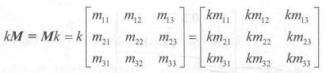

#### 2.矩阵和矩阵的乘法

1. $r \times n$ 的矩阵A和 $n\times c$ 的矩阵B相乘，结果是一个 $r \times c$ 的矩阵
2. A的 列 数量必须和B的 行 数量相同 
3. 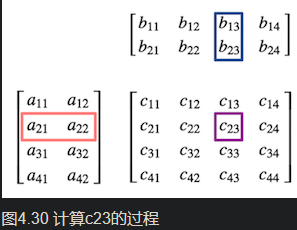
4. 性质：不满足交换律$AB \neq BA$
5. 满足结合律：$A(BC) = (AB)C$，可以推广到$ABCDE = ((A(BC))D)E = (AB)(CD)E$

### 4.4.4 特殊的矩阵

#### 1.方块矩阵

1. 指行列数目相等的矩阵

2. 具有特殊的 **对角元素（diagonal elements）**，指的是<u>行号列号</u>相等的元素，排布在矩阵的**对角线**上

3. 如果除了对角元素外，所有都是0，那么就叫做**对角矩阵（diagonal matrix）**

   1. $$
      M = \begin{bmatrix}
         1 & 0 & 0& 0 \\
         0 & 5 & 0& 0 \\
         0 & 0& 9 & 0 \\
         0 & 0 & 0 & 1 \\
        \end{bmatrix}
      $$

#### 2.单位矩阵

1. $$
   M = \begin{bmatrix}
      1 & 0 & 0& 0 \\
      0 & 1 & 0& 0 \\
      0 & 0& 1 & 0 \\
      0 & 0 & 0 & 1 \\
     \end{bmatrix}
   $$

2. 任何矩阵乘 单位矩阵 都不变 $MI=IM=M$

#### 3.转制矩阵

1. **转置矩阵(transposed matrix)** 是对原矩阵运算，$r\times c$ 的$M$的转置表示成 $c\times r$ 的 $M^T$
2. 表示为$M_{ij}^T = M_{ji}^T$
3. 性质：
   1. $(M^T)^T = M$
   2. $(AB)^T = B^TA^T$ ==重点==

#### 4.逆矩阵 

1. 矩阵有逆矩阵，首先要是个**方阵**，非零矩阵
2. 最重要的性质：$MM^{-1} = M^{-1}M = I$
3. 如果矩阵有逆矩阵，那他就是**可逆的(invertible) 非奇异的(nonsingular)**，
4. 没有逆矩阵则是 **不可逆的（noninvertible） 奇异的（singular）**
5. **<u>简单判断是否可逆</u>**：方阵的**行列式（determinant）**不等于0。调用C++数学库Eigen
6. 重要性质：
   1. $MM^{-1} = M^{-1}M = I$
   2. $(M^{-1})^{-1} = M$
   3. $I^{-1} = I$
   4. $(M^T)^{-1} = (M^{-1})^T$ 转置矩阵 的 逆矩阵 就是 逆矩阵的 转置
   5. $(AB)^{-1} = B^{-1}A^{-1}$
      1. 引申：$(ABCD)^{-1} = D^{-1}C^{-1}B^{-1}A^{-1}$
      2. 逆矩阵==**几何意义**==：矩阵表示一个<u>变换</u>，逆矩阵就可以 **<u>还原这个变换</u>**，或者说 计算变换的 <u>**反向变换**</u>
      3. 可以通过结合律证明：$M^{-1}(Mv) = (M^{-1}M)v=Iv=v$

#### 5.正交矩阵（orthogonal matrix）

1. 如果，**方阵M** 和 转置矩阵 相乘结果为 单位矩阵I，那么就是**正交的（orthogonal）**

2. $MM^T = M^TM = I$ 等价于 $M^T = M^{-1}$，转置矩阵 == 逆矩阵

3. <u>**如何判断是不是正交矩阵？**</u>直接判断$MM^T = I$ 过于消耗性能
   1. 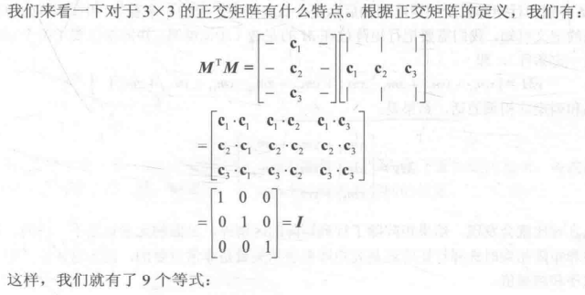
   
   2. 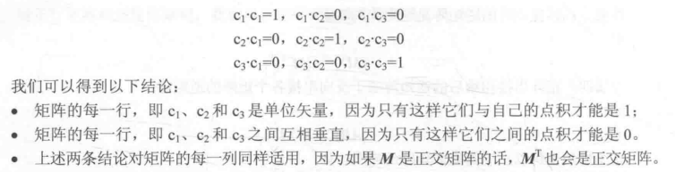
   
   3. 满足上述条件就是**正交矩阵**
   
      1. 一组 **标准正交基（两矢量相互垂直 && 模为1）** 精确满足上述条件
      2. 若这些 基矢量是一组**标准正交基**，就可以直接转置矩阵求逆矩阵
      3. 复习**正交基**和**标准正交基**：一个坐标空间要指定一组基矢量（也就是坐标轴），若这些 **基矢量**相互垂直，则是一组 **正交基（orthogonal basis）**，若它们 模 = 1，则是 **标准正交基（orthonormal basis）**
      4. 因此，<u>**正交矩阵**的 行 和 列 分别构成了一组 标准正交基</u>
   
### 4.4.5 行矩阵还是列矩阵(矩阵变换 左乘 右乘问题)

1. 将一个 矢量 转换为 行矩阵或者 列矩阵 是<u>没有区别</u>的
   1. 但是若是和<u>矩阵相乘</u>，就会出现<u>差异</u>
   2. 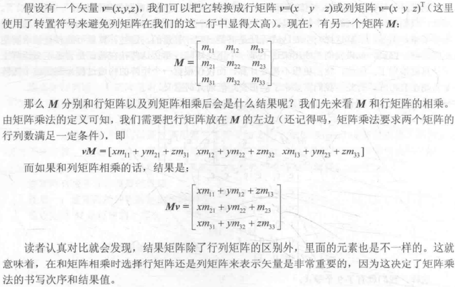
   3. $向量v和\ M相乘，Mv和vM差别巨大$
2. 在Unity中，通常将矢量放在<u>**矩阵右侧，$v$转 列矩阵 计算**</u>（也就是**右乘**）
   1. 例如$CBAv = (C(B(Av)))$
   2. 如果是左乘：等价于 $vA^TB^TC^T = (((vA^T)B^T)C^T)$

## 4.5 矩阵的几何意义：变换

**变换（transform）**表示我们把一些数据，点，矢量，颜色等转换的过程。

1. **线性变换（linear transform）**：可以保留 
   $$
   矢量加： f(x)+f(y)=f(x+y) \\
   标量乘： kf(x) = f(kx)
   $$
   的变换

   1. 线性变换包含，旋转，缩放，**错切(shear)，镜像(mirror，reflection)，正交投影（orthographic projection）**
   2. 仅有线性变换不行，如平移变换 ,满足标量乘法，不满足矢量加法。所以不能用一个3*3的矩阵表示平移变换。
   3. 如此就有了**仿射变换( affine transform)**，其合并了 **线性变换** 和 **平移变换** 的变换类型，使用4*4矩阵表示，将矢量扩展到 <u>四维空间</u> 下，这就是 **齐次坐标空间（homogeneous space）**

2. 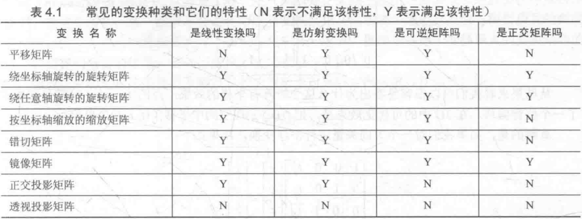

   1. 从中可看出，**<u>旋转，镜像</u>** 变换矩阵，因为是**正交矩阵** 只需要转置一下，就能逆运算

### 4.5.2 齐次坐标 homogeneous coordinate

- 3 * 3矩阵无法表示平移操作，扩展到4 * 4矩阵
- 对于<u>点Point</u> ，将其$w$分量设为1，对于<u>矢量Vector</u>，将其$w$ 设为0。
- 这样可以使**操作矢量的时候，平移被忽略*

### 4.5.3 分解基础变换矩阵

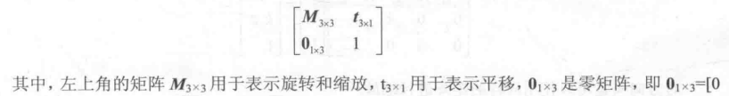

### 4.5.4 平移矩阵

1. 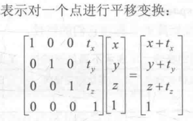
2. 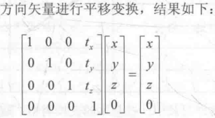
3. 可以看出点可以被平移，矢量因为平移无意义，所以即使平移变换后也没用
4. 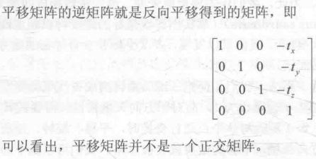

### 4.5.5 缩放矩阵

1. 对模型缩放：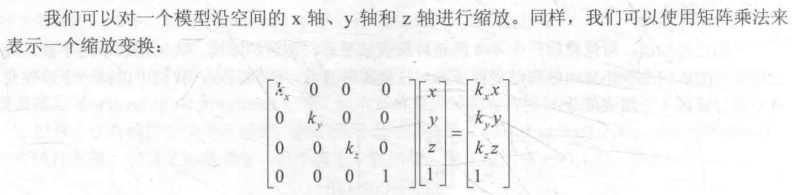
2. 对矢量缩放：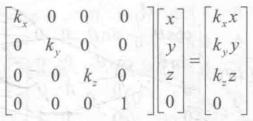
3. 如果缩放系数是$k_x = k_y=k_z$ 则是 **统一缩放（uniform scale）**
   1. 扩大整个模型，不改变角度和比例信息
4. 否则是 **非统一缩放（nonuniform scale）**
   1. 积压 拉伸 模型，改变角度和比例信息
   2. 比如对<u>法线变换</u>时，有非统一缩放，直接<u>变换顶点</u>会出错
5. 逆矩阵，反向操作，一般不是正交矩阵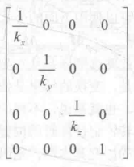
6. 上述**只用于 沿坐标轴方向**进行缩放，若我们希望 **任意方向缩放**，就需要复合变换，比如将 缩放轴变成标准坐标轴，沿着坐标轴缩放。

### 4.5.6 旋转矩阵

1. 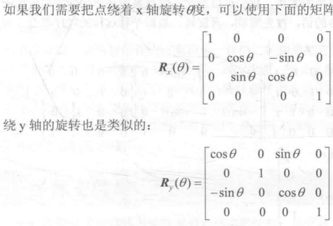
2. 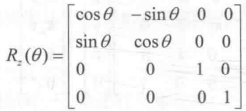
3. 逆矩阵：**<u>旋转矩阵是正交矩阵</u>**，多个旋转矩阵间的串联同样是正交的

### 4.5.7 复合变换

1. 将平移、旋转、缩放组合起来形成复杂变换。
2. 大多数情况，约定顺序是 **1.缩放，2.旋转，3.平移** ==一定要注意顺序==
3. $P_{new} = M_{translate} M_{rotation} M_{scale\theta}P_{old}$
   1. 针对y轴：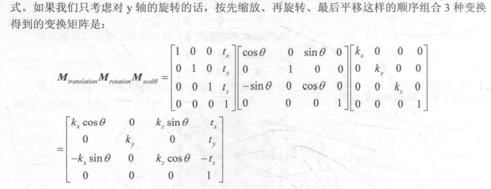
   2. 如果变换顺序，矩阵就会出错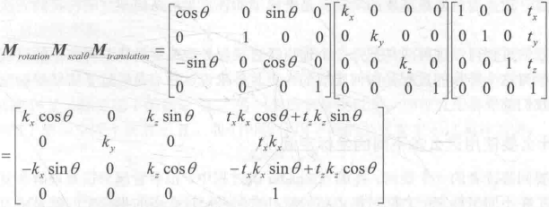
4. ==旋转顺序也是至关重要==，若同时绕三个轴旋转，是如何旋转顺序的？
   1. 当我们自己给出$(\theta_x,\theta_y,\theta_z)$时，需要自己定义一个旋转顺序
   2. Unity中，这个顺序是，**Z X Y**
   3. 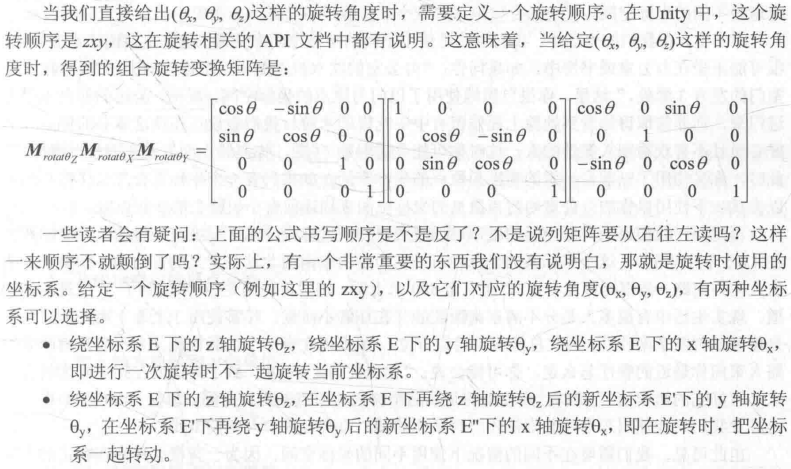
   4. unity文档表示是第一种情况，我们发现 情况一的 **Z X Y** 和情况二的 **Y X Z**一样

## 4.6 坐标空间

顶点着色器 最基本的功能 就是把 **模型**的**顶点坐标**从**模型空间**转换到**齐次裁剪坐标空间**，渲染游戏可以理解成把 一个个顶点 经过层层处理，最终转化到屏幕上的过程。

### 4.6.1 为什么要用这么多不同的坐标空间

- 开发过程 不可以 抛弃不同的坐标空间，所有坐标空间理论平等。

### 4.6.2 坐标空间的变换

1. 定义一个坐标空间：定要指明 原点位置，三个坐标轴方向。这些是相对于另一个坐标空间的
   1. 坐标空间有层次结构，每个坐标空间都是 另一个坐标空间的 **子空间**
   2. 坐标空间变换实际上就是，父空间 和 子空间 的变换
   3. 假设：父空间 **P** 和子空间 **C** ,一般会有两种需求：
      1. 子空间点或矢量 $A_C$转换到父空间下表示 $A_P$：$A_P=M_{C \rightarrow P}A_C$
      2. 父空间点或矢量 $A_P$ 转换到子空间下表示 $A_C$：$A_C=M_{P \rightarrow C}A_P$
      3. $M_{C \rightarrow P} $ 和 $M_{P \rightarrow C}$是逆矩阵
2. 如何求 **子空间** 到 **父空间** 的 变换矩阵 $M_{C \rightarrow P}$
   1. 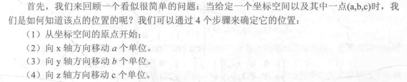
   2. 上述步骤是我们想象，实际上点没动，坐标空间的变换就在这四个步骤上。
   3. 子坐标空间：$C$ 的**3个坐标轴**，在父坐标空间$P$ 下表示为 $x_C\ y_C\ z_C$ ，原点位置$O_C$
   4. 给定一个子子坐标空间中一点 $A_C = (a,b,c)$，依照上四个步骤确定$A_P$
   5. 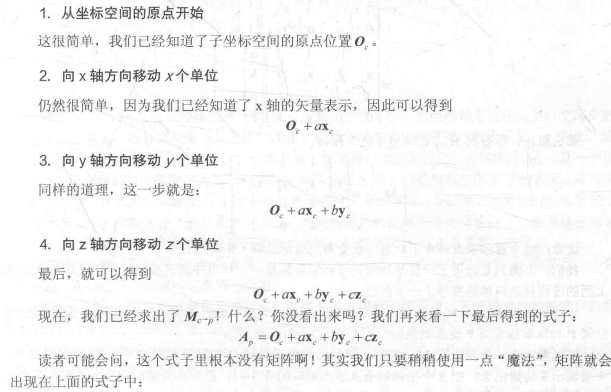
   6. 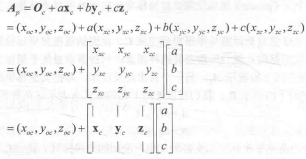
   7. 添加平移变换，扩展到齐次坐标空间：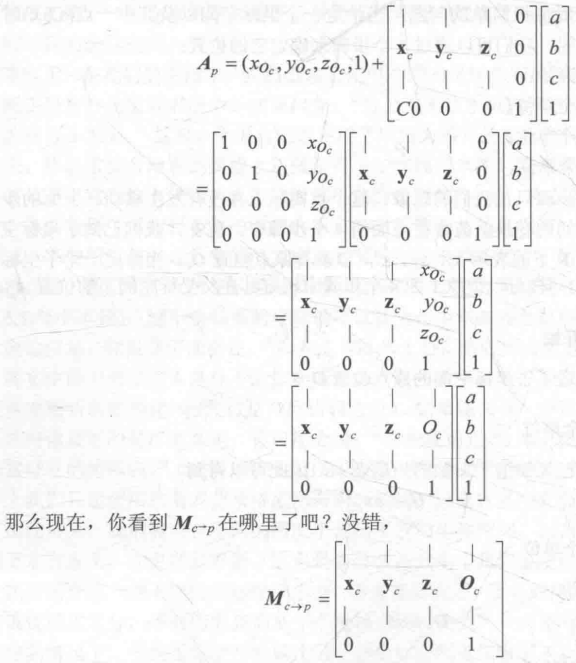
      1. 将**三个坐标轴**放入矩阵前三列
      2. 将$O_C$**原点矢量**放在最后一列
      3. 记得转化齐次坐标空间
   8. 求出 $M_{C\rightarrow P}$ 之后，求 **逆矩阵** 就可以求出 $M_{P\rightarrow C}$ 
   9. 我们不要求 3个坐标轴  $x_C\ y_C\ z_C$ 是单位矢量。若有缩放，三个矢量很可能不是单位矢量
3. 可以反向思维，从上述变换矩阵，反推 获取 子坐标空间的**原点** 和**坐标轴方向**
   1. 如：知道 **模型空间** 到 **世界空间** 的 $4 \times 4$的变换矩阵，取第一列 **归一化**，取得 模型空间的 **x轴** 在 世界空间 得单位矢量表示。也可得到 y、z轴
   2. 因为$M_{C \rightarrow P}$ 可以把一个方向矢量从 坐标空间C，变换到P
   3. 所以，只需要用 $M_{C \rightarrow P}$ 变换 空间C 中的 X轴(1,0,0,0)，使用 $M_{C \rightarrow P}[1\ 0\ 0\ 0]^T$, 得到的结果正是 $M_{C \rightarrow P}$ 第一列
4. **矢量的坐标空间变换**：矢量没有位置，因此 坐标空间的 **原点变换可以忽略**，不需要**平移变换**
   1. 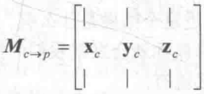
   2. shader中，常常看到，截取变换矩阵 **前3行 前3列**对 <u>法线方向，光照方向</u>进行空间变换，这就是原因

5. 再看回$M_{P \rightarrow C}$ , 除了求$M_{C \rightarrow P}$ 的逆矩阵之外，如果$M_{C \rightarrow P}$ 是 **正交矩阵**，只需要**转置**，便可以取得$M_{P \rightarrow C}$
   1. 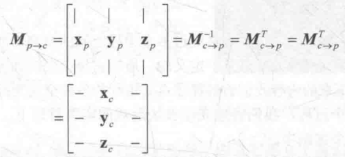
   2. **正交矩阵** 情况下，P空间的 $x_P\ y_P\ z_P$ 直接就是$M_{C \rightarrow P}$ 的每一行
   3. 上图可看出规律，坐标轴摆放 **列** 和 **转换前 的空间** 一致

6. 验算：验证坐标轴摆放是按列 还是 按行
   1. 例： 矢量 从 $A \rightarrow B$ 知道 B的 $X_B\ Y_B\ Z_B$, 想要知道 $M_{A \rightarrow B}$ 
      1. 从上图规律可以看出，如果  $M_{A \rightarrow B}$ 是**正交矩阵**，$X_B\ Y_B\ Z_B$ 分别是  $M_{A \rightarrow B}$ 的 **每一行**
      2. 那么如果如此摆放：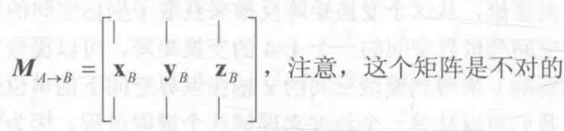
      3. 这个矩阵结果应该就是(1,0,0)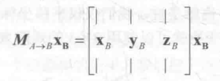
      4. 但是实际上应该是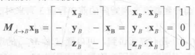


### 4.6.3 顶点的坐标空间变换过程

一个顶点是如何从 **模型空间** 转换到 **屏幕空间的**，经过了数个坐标空间


### 4.6.4 模型空间(model space)

1. 也被称为 **对象空间(object space) 局部空间(local space)**
2. 每个**模型**都有自己独立的坐标空间，当 **模型**变换的时候，**模型空间**也会跟着**变换**
   1. （当我们自己转身的时候，我们的前后左右也在跟着自己变）
3. 方向概念 **前forward 后back 左left 右right 上up 下down**，本书将其称为自然方向
4. Unity是 **左手坐标系** 模型空间的 原点和坐标轴通常在建模软件中确定，导入Unity中后，可以在**顶点着色器**中访问到模型的顶点信息。
5. 每个**模型** 都有一个**模型坐标空间** 时刻跟着他
   1. 

### 4.6.5 世界空间 world space

1. 建立了我们关心的**最大空间**，在游戏中可以描述 **绝对位置**，指的就是世界坐标位置，通常将原点放在游戏空间中心
2. ==Unity中== 世界空间也用 左手坐标系，X，Y，Z轴固定不变，
   1. 我们可以调整**Transform**组件中的**Position**属性改变模型位置，
   2. 这里 **Position** 是相对于Transform的**父节点(parent)**的 **模型坐标空间**的原点定义的
   3. 如果没有 **父节点** 那么 **Postion**就是世界坐标系的 位置
   4. 
3. ==顶点变换1== 将顶点坐标 从 模型空间 变换到 世界空间中，叫 **模型变换（model transform）**
   1. 
   2. 从上图信息，我们知道**世界空间**中，**Scale:(2,2,2) Rotation(0,150,0)Position(5,0,25)**
   3. 变换顺序不可变：**1.缩放 2.旋转 3.平移**
   4. 

### 4.6.6 观察空间 （View space）

1. 也被称为 **摄像机空间（Camera space）**，可以认为是 **<u>模型空间的一个特例</u>**：所以模型中，有一个非常特殊的模型，就是**摄像机**，所以他的模型空间，也就是观察空间，值得讨论
   1. Unity用左手坐标系，Unity的Camera是**右手坐标系**，符合OpenGL
   2. Camera +x指向右边，+y指向上方，-z指向前方
   3. `Camera.cameraToWorldMatrix`和`Camera.worldToCameraMatrix`计算观察空间中的位置，需要注意这些差异
2. **观察空间** 和 **屏幕空间** 不一样，前者三维空间，后者二维空间，二者之间需要 **投影（projection）**操作
3. ==顶点变换2== 顶点坐标从 **世界空间** 到 **观察空间** **叫做观察变换（view transform)**
   1. 
   2. 两种方法，第一种就是之前的 **模型变换**提到的方法，构建 模型空间到世界空间**变换矩阵**，再**求逆** 得到**世界空间**到**观察空间**的 变换矩阵
   3. 第二种：想象平移整个观察空间，<u>摄像机原点 移到 世界坐标的原点，坐标轴和 世界空间的 坐标轴 **重合**</u>
      1. 由camera<u>当前</u>的transform组件，得知**先旋转(30,0,0)，后平移(0,10,-10)**，为了把camera和世界空间坐标轴重合，逆向变换，**先反方向平移(0,-10,10)，后反方向旋转(-30,0,0)**
      2. 
      3. 观察空间是**右手坐标系**，对Z轴进行取反操作
      4. 
      5. 

### 4.6.7 裁剪空间 clip space

1. ==顶点变换3== 裁剪空间clip space 也被称为 **齐次裁剪空间**，变换矩阵叫裁剪矩阵，也被称为 **投影矩阵（projection matrix）**
2. **目标：** 方便地对 渲染图元进行裁剪。
   1. **完全在空间内部**的图元将会被保留
   2. **完全位于图外**的图元会被剔除
   3. **与空间边界相交**的图元被裁减。
   4. 这块空间由 **视锥体（view frustum）**决定
   5. 视锥体决定了摄像机可以看到的空间。由 六个平面包围，这些平面被称为 **裁剪平面（clip planes）**
3. 视锥体两种类型：**正交投影（orthographic projection）透视投影（perspective projection）**
   1. 
   2. 有两块裁剪平面很特殊：**近裁剪平面（near clip plane）远裁剪平面（far clip plane）**。决定了摄像机可以看到的深度范围。
   3. 
4. 投影矩阵两个目的：（投影指空间降维）
   1. **为投影做准备**，他没有真正做投影，而是做准备，**真正的投影在齐次除法（homogeneous division）** 经过<u>投影矩阵后</u> 顶点的 $\omega$ 分量会有意义
   2. **对x、y、z 分量进行缩放**。上面说用6个裁剪平面裁剪很麻烦，经过投影矩阵的缩放，可以直接使用 **$\omega$ 分量作为一个范围值**，如果x、y、z 都在范围内，说明在裁剪空间中

#### 1.透视投影


- 从Camera组件的**Field of View（FOV）**属性改变视锥体角度
- Clipping Planes 代表 <u>近裁剪平面 远裁剪平面</u>距离摄像机远近，

1. 由此求出 远裁剪平面 近裁剪平面 **高度**（垃圾学渣补充了个过程，一眼看不出来）
   1. $$
    \frac{0.5*nearClipPlaneHeight}{Near} = \tan{\frac{FOV}{2}} \\
       nearClipPlaneHeight = 2 · Near· \tan \frac{FOV}{2} \\
       farClipPlaneHeight = 2 · Far· \tan \frac{FOV}{2}
    $$

2. 缺乏横向信息，Unity中可通过 **Gamera.aspect** 修改摄像机**宽高比**计算

   1. $$
      Aspect = \frac{neraClipPlaneWidth}{neraClipPlaneWidth} \\
      Aspect = \frac{farClipPlaneWidth}{farClipPlaneWidth} 
      $$
      
      

3. 透视投影矩阵如下：

4. Unity中，我们针对的**观察空间** 是 **右手坐标系**， 列矩阵在矩阵右侧相乘，

5. 变换后 Z 的分量将在$[-\omega, \omega]$之间，DirectX的API中，Z范围在$[0, \omega]$之间

6. 

7. **透视矩阵本质：**便是对 x、y、z 分量进行缩放，Z分量还做了一个平移

8. **目的**：是为了方便裁剪

9. 此时顶点的 $\omega$ 分量，从 1 变成了 z 分量取反 之后的结果

10. 按照如下不等式可以判断顶点是否在视锥体内：

    1. $$
       -\omega <= x <= \omega\\
       -\omega <= y <= \omega\\
       -\omega <= z <= \omega
       $$

11. 

12. 图中标注关键4点，四个分量发生了变化

13. 并且空间从右手变成了左手坐标系，Z值越大，离摄像机越远

#### 2.正交投影


1. Camera组件中 **Size** 是竖直高度的一半，Near Far控制远近平面距离

   1. 求出高度
      $$
      nearClipPlaneHeight = 2·Size \\
      farClipPlaneHeight = nearClipPlaneHeight
      $$

   2. 得到摄像机横纵比：**Aspect**
      $$
      nearClipPlaneWidth = Aspect · nearClipPlaneHeight \\
      farClipPlaneHeight = nearClipPlaneHeight
      $$

   3. 确定正交投影矩阵，建立在Unity对坐标系假定上的：

   4. 

   5. 正交投影的 $\omega$ 分量依旧是1

   6. ==区别==：最后一行上：透视投影 [0 0 -1 0] 正交投影 [0 0 0 1] **为齐次除法做准备**

   7. 

   8. 

   9. 

   10. 

   11. 判断是否需要裁减

### 4.6.8 屏幕空间

==顶点变换4== ：完成了所有裁剪工作，就可以**真正的投影**了：<u>将视锥体投影到 **屏幕空间（screen space）**</u>

- 我们将得到真正的像素位置，而不是虚拟的三维坐标
1. 屏幕空间是一个二维空间，这个过程有两个步骤：

   1. 标准 **齐次除法（homogeneous division）**也被称为**透视除法（perspective division）**：其实就是用 $\omega$ 分量，除以 $x,y,z$ 分量

      1. OpenGL中，得到坐标叫做 **归一化的设备坐标（Normallized Device Coordinates， NDC）**
      1. 经过 **齐次除法** 后，变换到一个**立方体**内
      1. OpenGL标准： $x,y,z$ 分量范围[-1 , 1] **Unity使用**
      1. DirectX中， $x,y$ 分量范围[-1 , 1]，$z$ 分量范围[0 , 1]
      1. 
      1. 齐次除法对正交投影没有影响，因为 $\omega$ 分量是1

   1. 齐次除法后，根据变换后的 x 和 y 坐标 **映射输出 窗口对应的像素坐标**

      1. Unity中 **左下（0,0）右上坐标（pixelWidth，PixelHeight）**
      1. 现在的 x，y 坐标**范围都在[1,-1]**

   1. 齐次除法和屏幕映射过程见下面公式：

      1. $$
         screen_x = \frac{clip_x · pixelWidth}{2·clip_w}+\frac{pixelWidth}{2} \\
         screen_y = \frac{clip_y · pixelWidth}{2·clip_w}+\frac{pixelWidth}{2}
         $$

      1. Z 分量 通常用于 **深度缓存中**，传统方法是直接把 $\frac{clip_z}{Clip_{\omega}}$ **存入深度缓存**中。驱动生产商会选择最优存储格式

      1. $Clip_{\omega}$也不会被抛弃，他完成了主要工作——**齐次除法中作为分母得到NDC**

      1. 但他在后续还有重要作用：**透视矫正差值**

   1. Unity中，**裁剪空间**到屏幕空间的转换，是unity完成的，顶点着色器只需要把顶点转换到 **裁剪空间**即可

   1. 裁剪空间中鼻子位置：**（11.691， 15.311， 23.692， 27.31）**，设屏幕像素宽度400，高度300

      1. 齐次除法，裁剪空间坐标投影到NDC中，再映射屏幕过程如下
      1. 


### 4.6.9 总结

1. **顶点着色器** 最基本任务 把顶点坐标从 模型空间 转换到 裁剪空间，对应前三个变换过程
2. **片元着色器** 通常可以得到该片元 在屏幕空间的像素位置。
3. 此处只给出**一些最重要的坐标空间**，还有开发中遇到的其他空间，如 **切线空间（tangent space）**通常用于 **法线映射**
4. 

## 4.7 法线变换

- **法线（normal）**也被称为 **法矢量（normal vector）**当我们变换顶点的时候，还需要变换**顶点法线**，以用于后续**计算光照**等（片元着色器）

- **切线（tangent）**顶点携带的另一种信息，通常和纹理空间对齐，与法线方向垂直

  - **切线是两个顶点之间的插值计算**得到的，我们可 **直接使用变换顶点的 变换矩阵 变换切线（tangent）**

  - 使用 3*3 的变换矩阵（因为是向量，不考虑平移）可以得到变换后的 **切线方向**
    $$
    T_B =M_{A\rightarrow B}T_A
    $$

  - 但是 **法线就不行了** 直接用 $M_{A\rightarrow B}$ 变换的可能不与表面垂直

  - 

- 用 **数学约束条件** 推出矩阵：

  1. 同一个顶点的切线 $T_A$ 和法线 $N_A$ 必须满足垂直条件:$ T_A · N_A = 0$

  2. $T_B =M_{A\rightarrow B}T_A$ , 需找到矩阵G变换法线 $N_A$​ , 使得变换后的**法线和切线垂直**
     $$
     T_A · N_A = (M_{A\rightarrow B }T_A)·(G \  N_A) = 0
     $$

  3. 

  4. $$
     G = (M_{A\rightarrow B }^T)^{-1} = (M_{A\rightarrow B }^{-1})^T
     $$

  5. ==法线变换重点==：

     1. 如果变换矩阵 $M_{A\rightarrow B }$  是**正交矩阵**，那么$M_{A\rightarrow B}^{-1} =M_{A\rightarrow B }^T$ , **变换顶点的 变换矩阵 可以直接 变换法线**
        1. 如果 **只有旋转变换**，就是**正交矩阵**
        2. 如果 **只有旋转 和 统一缩放**，就使用 **统一缩放系数k**变换矩阵：$ (M_{A\rightarrow B}^T)^{-1} = \frac{1}{k} M_{A\rightarrow B}$  以此避免求逆矩阵
        3. 如果**带有非统一变换** 就老老实实求逆矩阵吧

## 4.8 Unity Shader 内置变量（数学篇）

可以在 UnityShaderVariables.cginc 文件中找到定义说明

### 4.8.1 变换矩阵

 

1. 比较特殊 `UNITY_MATRIX_T_MV` 矩阵，对于**正交矩阵**，

   1. 若`UNITY_MATRIX_MV`是正交矩阵，`UNITY_MATRIX_T_MV` 就是它的**逆矩阵**，
   2. 可以直接用 `UNITY_MATRIX_T_MV` 将顶点 从 **观察空间** 变换到 **模型空间** 
   3. **只有旋转** `UNITY_MATRIX_MV` 是正交矩阵
   4. **只有旋转 和 统一缩放** `UNITY_MATRIX_MV` 逆矩阵就是 $\frac{1}{k}$`UNITY_MATRIX_T_MV` k是统一缩放系数
   5. 对于 **方向矢量**，只需 3*3 的矩阵，并在使用前都**归一化处理**，**消除统一缩放影响**

2. `UNITY_MATRIX_IT_MV` **法线变换** 需要 原本变换矩阵的  **逆转置矩阵**

   1. 因此 `UNITY_MATRIX_IT_MV` 可以变换法线，从 模型空间 到观察空间

   2. 但是我们只需要 **转置他** 得到 `UNITY_MATRIX_MV`的 **逆矩阵**

   3.  **观察空间** 变换到 **模型空间** 两种方法

      ```c#
      // 方法一：使用 transpose 函数 对 UNITY_MATRIX_IT_MV 转置
      // 得到 UNTIY_MATRIX_MV 的  逆矩阵  进行列矩阵乘法
      //观察空间 变换到 模型空间
      float4 modelPos = mul(transpose(UNITY_MATRIX_IT_MV),  viewPos);
      
      //方法二： 不用转置 transpose ， 交换 mul 乘法的位置，行矩阵乘法
      //本质和 方法一一样
      float4 modelPos = mul(viewPos, UNITY_MATRIX_IT_MV)
      ```

### 4.8.2 摄像机屏幕参数


## 4.9 答疑解惑


