# 基础
## 1. C#函数中 new 一个struct 对象 会不会产生垃圾回收？

```c#
    public struct CoordsStruct    {
        public CoordsStruct(double x, double y)
        { X = x;
          Y = y;        }
        public double X { get; set; }
        public double Y { get; set; }
        public override string ToString() => $"({X}, {Y})";
    }
    public class CoordsClass    {
        public CoordsClass(double x, double y)
        {   X = x;
            Y = y;        }
        public double X { get; set; }
        public double Y { get; set; }
        public override string ToString() => $"({X}, {Y})";
    }        
CoordsStruct coordStruct = new CoordsStruct(1, 1);
CoordsClass coordsClass = new CoordsClass(1, 1);
```

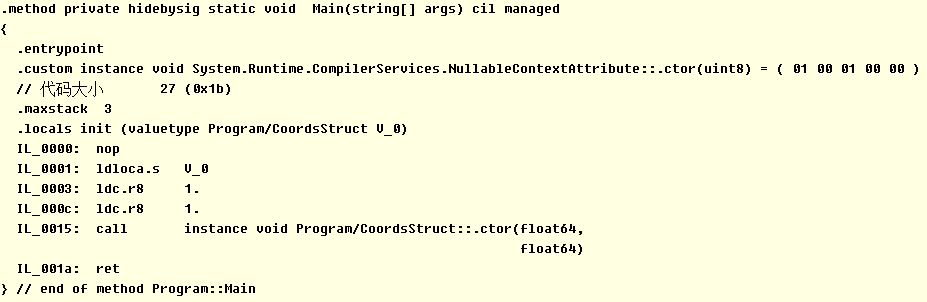

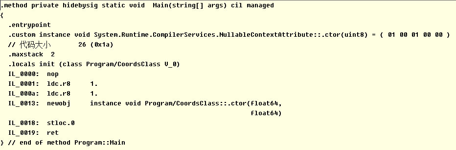

1. `new struct` 调用`ldlocal.s` 向栈压入本地变量地址，之后调用构造函数
2. `new class` 调用 `newobj`  创建一个值类型的新对象，并将对象引用推送到计算堆栈上，对象值放在堆上面
2. 所以new 一个struct对象不产生垃圾回收

```c#
CoordsStruct coordStruct = new CoordsStruct(1, 1);
CoordsClass coordsClass = new CoordsClass(1, 1);

var StructA = coordStruct;
var ClassB = coordsClass;

StructA.X = 1000;
StructA.Y = 1000;
ClassB.X = 2000;
ClassB.Y = 2000;
        // 输出
//coordStruct     (1, 1)
//StructA         (1000, 1000)
//coordsClass     (2000, 2000)
//ClassB          (2000, 2000)
```

由此可看出 new 出来的 struct 对象是值类型，赋值操作会有拷贝（传参也会有拷贝），new class对象是引用。

参考博客：[CLR、内存分配和垃圾回收](https://www.cnblogs.com/dotnet261010/p/9248555.html)

## 2. C#在函数中 new 一个数组 会不会产生垃圾回收？

```c#
        int[] intArray = new int[]{1,2,3};
        char[] charArray = new char[]{'1','2','3'};
        string[] stringArray = new string[]{"12","34","56"};
```

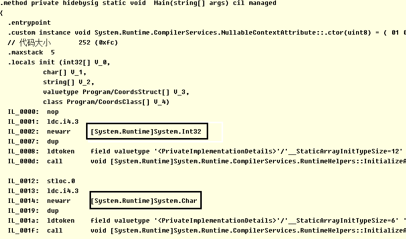

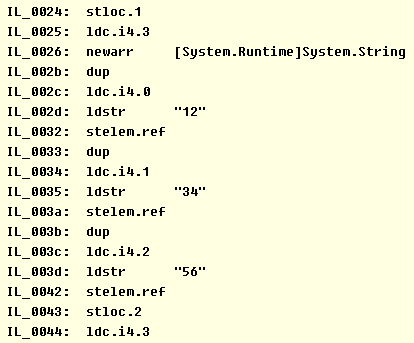

无论是int char 还是string数组，都调用了`newarr` 命令：为值申请内存分配在托管堆上，并且添加引用在栈上，**会产生垃圾回收**

## 3. C#在函数中 new 一个struct对象数组 会不会产生垃圾回收？

```c#
        CoordsStruct[] coordStruct = new CoordsStruct[]
        {
            new CoordsStruct(1, 1),
            new CoordsStruct(2, 2),
            new CoordsStruct(3, 3),
        };
        CoordsClass[] coordsClass = new CoordsClass[]
        {
            new CoordsClass(1, 1),
            new CoordsClass(2, 2),
            new CoordsClass(3, 3),
        };
```

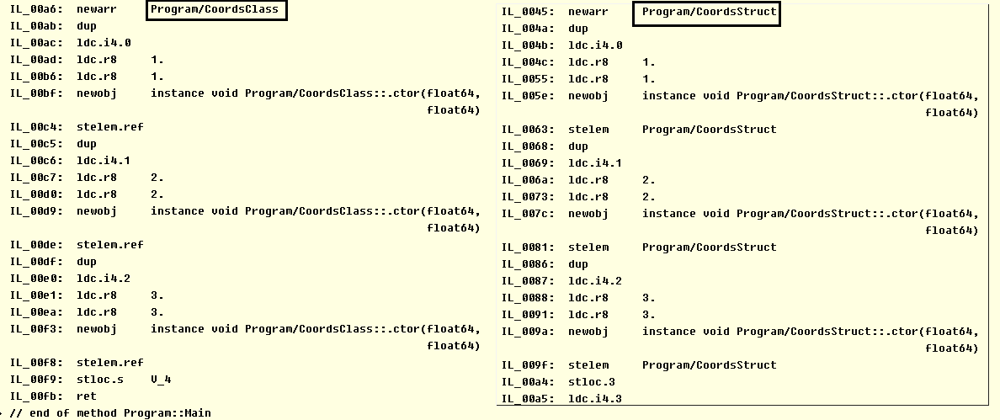

无论是new struct 还是class数组，都调用了`newarr` 和`newobj` 命令，**会产生垃圾回收**。

## 4. unity的部分对象如：Mesh，AnimationClip 等对象 new 出来之后需不需要主动释放？

```c#
public Mesh mesh;
public AnimationClip animationClip;

private int num;
// Start is called before the first frame update
void Start()
{
    mesh = new Mesh();
    animationClip = new AnimationClip();
    num = 0;
}

// Update is called once per frame
void FixedUpdate()
{
    num = num + 1;
    if (num == 50 * 5)
    {
        mesh = null;
        animationClip = null;
        Debug.Log("Set Null num :  " + num);
    }        
    if (num == 50 * 10)
    {
        Destroy(mesh);
        Destroy(animationClip);
        Debug.Log("Destroy both num :  " + num);
    }        
    if (num == 50 * 15)
    {
        GC.Collect();
        Debug.Log("GC.Collect num :  " + num);
    }
```

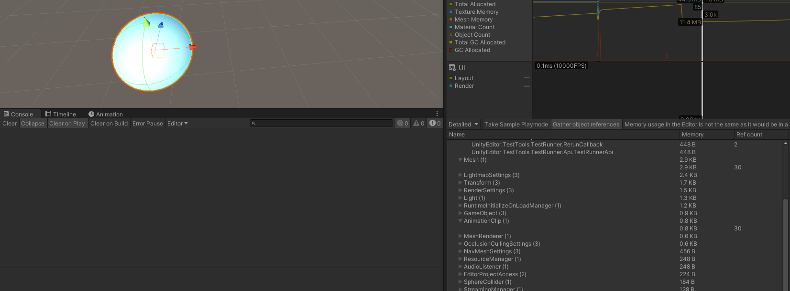

将mesh 和 Animation Clip置空引用次数没有归零

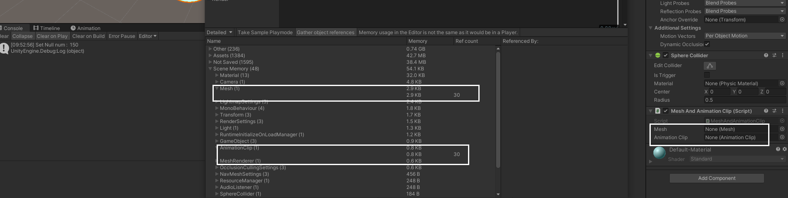

调用`Destory`之后引用次数归零

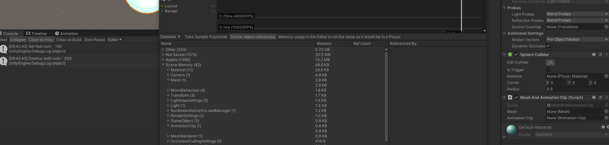

## 5. 想办法评估下 Lua和C# 在循环里持续产生内存垃圾对性能的影响

C#占用：

```c#
public class CShapeGC : MonoBehaviour
{
    public class obj
    {
        public int num;
        public obj(int num) { this.num = num; }
    }
    void FixedUpdate()
    {
        // 一秒50次，一秒生成150个对象
        obj a = new obj(1);
        obj b = new obj(2);
        obj c = new obj(3);
    }
}
```

lua占用:

```c#
LuaGC.cs
public class LuaGC : MonoBehaviour
{
    LuaState lua = null;    
    [SerializeField] string luaFile = "luaObject";
    LuaFunction func;  
    void Start()
    {
        lua = new LuaState();
        lua.Start();
        string filePath = Application.dataPath + "/Test";
        lua.AddSearchPath(filePath);
        lua.Require(luaFile);
        func = lua.GetFunction("initLuaObject");

    }
    void FixedUpdate()
    {
        // 每秒生成150个对象
        func.Call();
        func.Call();
        func.Call();
    }
}
```

```lua
-- luaObject.lua
LuaObject = { num = 0 }
local mt =
{
    __index = Lua_SpawnObj,
    __call = function(self, num) self.num = num end
}
function LuaObject:new(num)
    self = self or {}
    setmetatable(self, mt)
    self(num)
    return self
end
function initLuaObject()
    local tab = LuaObject:new(123)
    print(tab.num)
end
```

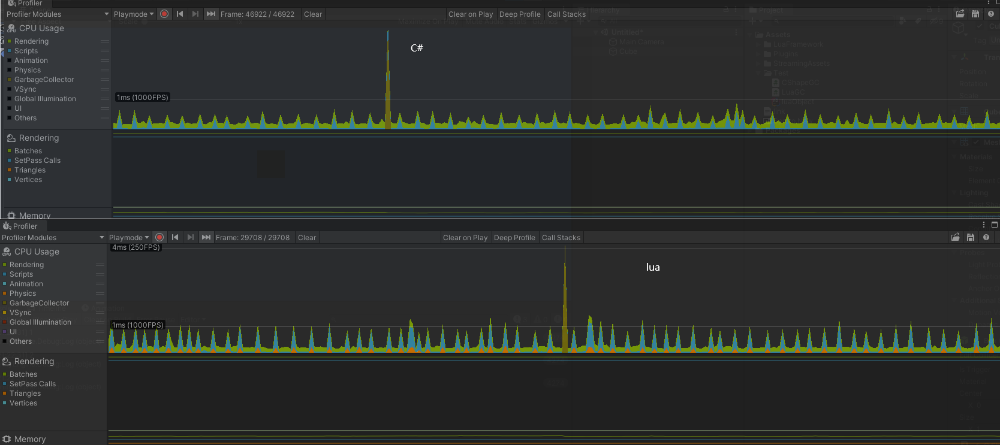

从表中可以看出，lua的平均消耗在1ms上下，GC到达4ms。 C#的平均消耗在1ms一半位置，GC也没有打到4ms。

## 6. 加载unity资源：AnimatorController，材质， 贴图，动作文件 需不需要释放，需要的释放使用什么接口？

[Resources和AssetBundle最详细的解析](https://blog.csdn.net/xinzhilinger/article/details/115408934)

1. **Resources**

   1. 一般用 `Resources.Load` 加载 `Asset\Resources`目录下的特定资源，一般还会实例化到场景中。

      1. 资源被加载到Asset中，还会产生一个Clone到Scene Memory中

   2. 关于Resources的方法：

      1. ```
         1. FindObjectsOfTypeAll:返回某一种类型的所有资源
         2. Load：通过路径加载资源
         3. LoadAll：加载该Resources下的所有资源
         4. LoadAsync：异步加载资源，通过协程实现
         5. UnloadAsset：卸载加载的资源
         6. UnloadUnusedAssets：卸载在内存中未使用的资源（整个游戏对象层级视图后未访问到某资源（包括脚本组件），则将其视为未使用的资源）
         ```

   3. ```lua
      public class LoadResourcesTwoWays : MonoBehaviour
      {
          private GameObject modelInstantiate;
          // Start is called before the first frame update
          void Start()
          {
              var obj = Resources.Load("shieldUp");
              
              modelInstantiate = Instantiate(obj) as GameObject;
              modelInstantiate.transform.position = Vector3.zero;
              
              obj = null;
              Resources.UnloadUnusedAssets();
              // LoadResourcesToScene();
              // LoadABResource();
          }
          // Update is called once per frame
          void Update()
          {
              if (Input.GetKey(KeyCode.A))
              {
                  Destroy(modelInstantiate);
              }   
          }
      }
      ```

      没有执行`Destory`的内存，Scene Memory内存占用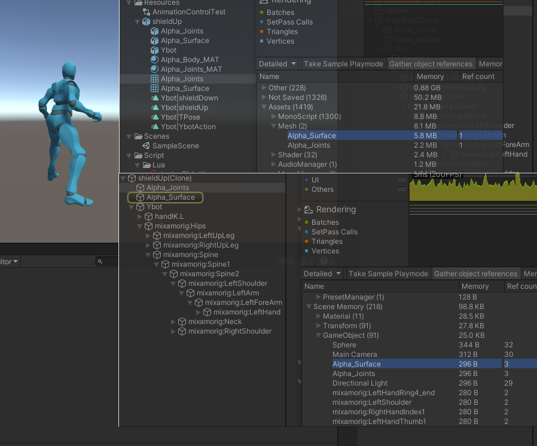

      调用`Destory`之后Assets内存里还有，Scene Memory内存从218变成42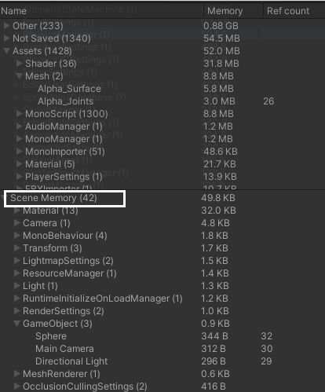

   4. 可以使用`DestroyImmediate(object, true)`立即摧毁Asset中的内存

      1. 但是这只会在「只有在Asset，没有在SceneMemory占用」的情况下生效
      2. 如果同时存在两者的占用，那`DestroyImmediate`只能释放在 SceneMemory 中的内存，
      3. 且即使释放了Scene Memory的内存后，**再次使用 **DestroyImmediate 也不能释放在Asset裡面的内存占用

   5. `Resources.UnloadAsset`：卸载 Asset 加载的资源

      1. ```c#
         Resources.UnloadAsset(modelInstantiate);
         //该方法无法释放SceneMemory中的内存（场景中的Clone），只能释放Asset裡面的内存
         ```

   6. `Resources.UnloadUnusedAssets`：卸载在内存中未使用的资源（整个游戏对象层级视图后未访问到某资源（包括脚本组件），则将其视为未使用的资源）

      1. ```c#
         model = null;
         AnimationControlTest = null;
         Resources.UnloadUnusedAssets();
         // 释放所有Resource加载的所有Asset内存
         // 以把Asset和SceneMemory裡的内存一并释放
         ```

   7. 总结：**Resources加载的资源是需要释放**，即使调用了 `Destory(obj)`，也要记得`DestroyImmediate(obj, true)`或者`UnloadAsset(obj)` 或者`UnloadUnusedAssets()` 释放 Assets 里面的内存

      1. 对于不会重複使用的 asset可以加载完之后马上调用`UnloadAsset`
      2. 在场景scene关闭前，调用`DestroyImmediate(obj, true)`清除所有的**SceneMemory**裡的占用
      3. 最后再使用`UnloadUnusedAssets`确认释放所有内存

2. **AssetBundle**

   1. 先打包AB包

      1. 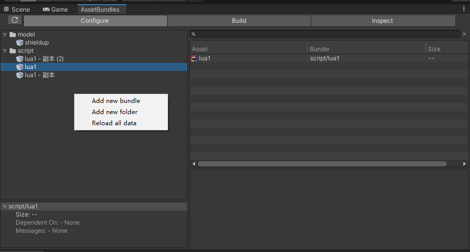
      2. 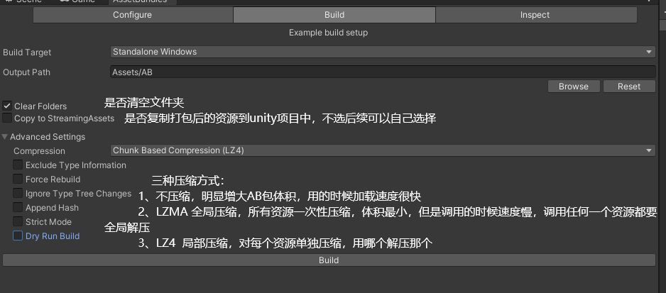
         1. No Compression 不压缩，明显会增大AB包的体积，但是在用的是否加载速度会快很多
         2. LZMA，即所有资源一次性压缩，AB包的体积最小，但是对于资源调用时的速度会慢很多，因为调用任何的一个资源都需要全局解压
         3. LZ4，局部压缩，就是对于每一个资源单独压缩，用的时候就是用到哪一个，就解压哪一个

      3. 打包完成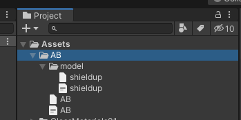

   2. 卸载AB包加载的资源内存占用的方式有两种：

      1. `(instance)ab.Unload(bool unloadAllLoadedObject)`只释放某个AB自身的内存占有

         1. When `unloadAllLoadedObjects` is **false**,compressed file data inside the bundle itself will be freed, 

            but any instances of objects loaded from this bundle will remain intact

         2. (bundle中的压缩文件被释放，实例化成功的保持原样)

         3. When `unloadAllLoadedObjects` is **true**, all objects that were loaded from this bundle will be destroyed as well. If there are GameObjects in your Scene referencing those assets, the references to them **will become missing**.

         4. (所有对象都要被销毁，scene中的asset引用也会被释放)

      2. `(static)AssetBundle.UnloadAllAssetBundles(bool unloadAllLoadedObject)`释放所有AB的占有内存

      3. 二者 都需要配合 `Destroy`销毁场景中的实例Instance，使用`Unload`销毁Assets中的内存


## 7. MonoBehaviour 数量过多 对性能影响如何，或者一个MonoBehaviour 自带的消耗有哪些？

1. 每一个`Monobehaviour` 都是通过**反射**来调用 生命周期函数 的（`Awake, Update, LateUpdate`等）
   1. Monobehaviour会在游戏开始时首先得到所有写有生命周期函数的脚本，保存下来后再调用这些生命周期方法。
2. 只要在`Monobehaviour`中声明了`Update`这样的生命周期函数，无论函数体裡是否有东西，该方法都会被执行，从对CPU造成一定的负荷

   - 场景上带有`Monobehaviour`且带有各种生命周期（尤其是`Update`函数）的脚本越多，CPU负荷越大，即使所有生命周期的方法体都没有内容

代码中只写一句`public class MonoBehaviourTest : MonoBehaviour{ }`的情况对比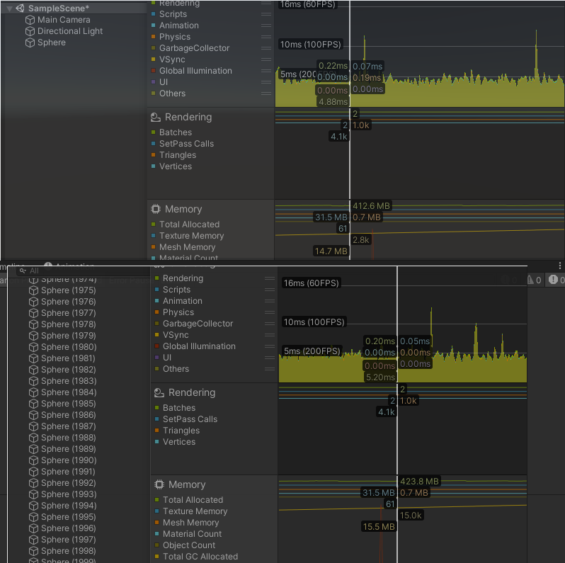

```lua
public class MonoBehaviourTest : MonoBehaviour
{
    private void Awake(){ }
    private void OnEnable(){ }
    void Start(){ }
    private void FixedUpdate(){ }
    private void OnTriggerEnter(Collider other){ }
    private void OnTriggerStay(Collider other){ }
    private void OnTriggerExit(Collider other){ }
    private void OnCollisionEnter(Collision collision){ }
    private void OnCollisionStay(Collision collision){ }
    private void OnCollisionExit(Collision collision){ }
    private void OnMouseDown(){ }
    private void OnMouseUp(){ }
    void Update(){ }
    private void LateUpdate(){ }
    private void OnRenderImage(RenderTexture source, RenderTexture destination){ }
    private void OnDisable(){ }
    private void OnDestroy(){ }
    private void OnApplicationQuit(){ }
}
```

测试代码声明内置生命周期函数后，性能消耗有明显上升

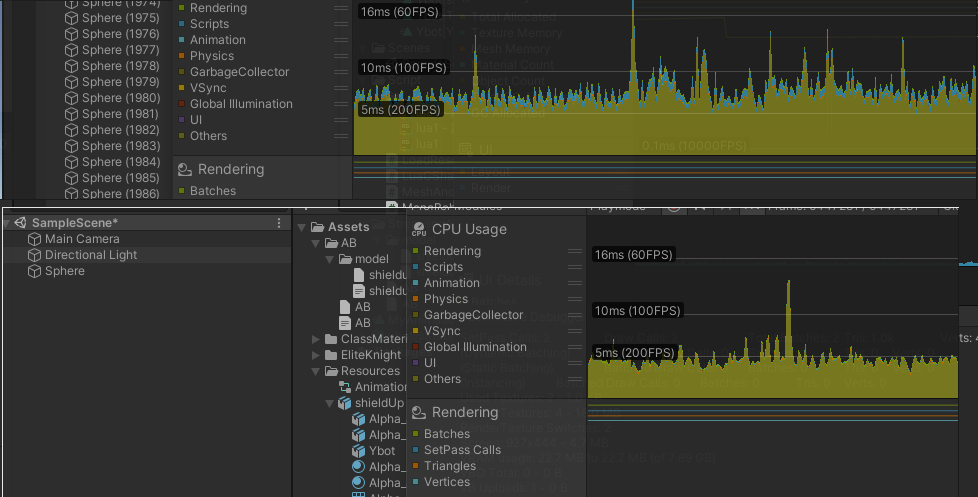

## 8. Lua的底层数据类型有哪些？

```
/*
** basic types
*/
#define LUA_TNONE       (-1)
#define LUA_TNIL        0
#define LUA_TBOOLEAN        1
#define LUA_TLIGHTUSERDATA  2
#define LUA_TNUMBER     3
#define LUA_TSTRING     4
#define LUA_TTABLE      5
#define LUA_TFUNCTION       6
#define LUA_TUSERDATA       7
#define LUA_TTHREAD     8
#define LUA_NUMTAGS     9
```

| 常用数据类型 | 描述                                                        |
| :------- | ------------------------------------------------------------ |
| nil      | 空值                                                         |
| boolean  | 布尔值：false和true。                                        |
| number   | 双精度浮点数                                                 |
| string   | 字符串（可用双引号或单引号）                                |
| function | 函数类型：由 C 或 Lua 编写的函数                             |
| userdata | 主要用来表示在C/C++中定义的类型，即用来实现扩展lua，这些扩展代码通常是用C/C++来实现的。对lua 虚拟机来说userdata提供了一块原始的内存区域 |
| thread   | 用于执行协同程序   [协同程序（线程thread）](https://www.cnblogs.com/Richard-Core/p/4373582.html) |
| table    | Lua 中的表（table）是一个"关联数组"（associative arrays），数组的索引可以是数字、字符串或表类型。在 Lua 里，table 的创建是通过"构造表达式"来完成，最简单构造表达式是{}，用来创建一个空表。 |

| 不常用数据类型 | 描述                                                         |
| :------: | ------------------------------------------------------------ |
|      none      | 仅用于 C API    [Is 'none' one of basic types in Lua?](https://stackoverflow.com/questions/38562720/is-none-one-of-basic-types-in-lua) |
| lightUserData | 轻量级用户数据是表示 C 指针的值（即`void *`值） [Light Userdata](https://www.lua.org/pil/28.5.html) |
| NUMTYPES | 双精度浮点数                                                 |

 `string` `table ` `function` `thread` 四种在 vm 中以**引用**方式共享，是需要被 GC 管理回收的对象。其它类型都以值形式存在。——[Lua GC 的源码剖析 (1)](https://blog.codingnow.com/2011/03/lua_gc_1.html)

## 9. 为什么说Lua一切皆Table,Table有哪两种存储形式，Table是如何Resize的，了解Resize的代价

1. Lua的table由 **数组部分（array part）**和 **哈希部分（hash part）**组成。
   1. 数组部分索引的key是1~n的整数，
   2. 哈希部分是一个哈希表，哈希表本质是一个数组，它利用哈希算法将键转化为数组下标，若下标有冲突，则会将冲突的下标上创建一个链表，用链地址法解决哈希冲突。
   3. table的 key 值可以是除了 nil 之外的任何类型的值
2. 向table中插入数据时，如果table满了，table会重新设置数据部分 和 哈希表的大小，**容量是成倍增加的（C++ vector）**，哈希部分还要对哈希表中的数据进行整理。
   1. 没有赋初始值的table，数组和部分哈希部分默认容量为0。

```c
//luaC语言源码: ltable.c
void luaH_newKey(lua_State *L, Table *t, const TValue *key, TValue *value){
        mp = mainpositionTV(t, key);
        if (!isempty(gval(mp)) || isdummy(t)) {  /* main position is taken? */
        Node *othern;
        Node *f = getfreepos(t);  /* get a free place */
        if (f == NULL) {  /* cannot find a free place? */
          rehash(L, t, key);  /* grow table */	// 重置哈希
          /* whatever called 'newkey' takes care of TM cache */
          luaH_set(L, t, key, value);  /* insert key into grown table */
          return;
        }
}
static void rehash (lua_State *L, Table *t, const TValue *ek) {
          unsigned int asize;  /* optimal size for array part 数组最佳大小*/
          unsigned int na;  /* number of keys in the array part 数组部分的 key（index） 的数量*/
          unsigned int nums[MAXABITS + 1];
          int i;
          int totaluse;
          for (i = 0; i <= MAXABITS; i++) nums[i] = 0;  /* reset counts */
          setlimittosize(t);
          na = numusearray(t, nums);  /* count keys in array part */
          totaluse = na;  /* all those keys are integer keys */
          totaluse += numusehash(t, nums, &na);  /* count keys in hash part */
          /* count extra key */
          if (ttisinteger(ek))
            	na += countint(ivalue(ek), nums);
          totaluse++;
          /* compute new size for array part */
          asize = computesizes(nums, &na);
          /* resize the table to new computed sizes */
          luaH_resize(L, t, asize, totaluse - na);
}
** Compute the optimal size for the array part of table 't'. 'nums' is a
** "count array" where 'nums[i]' is the number of integers in the table
** between 2^(i - 1) + 1 and 2^i. 'pna' enters with the total number of
** integer keys in the table and leaves with the number of keys that
** will go to the array part; return the optimal size.  (The condition
** 'twotoi > 0' in the for loop stops the loop if 'twotoi' overflows.)
*/
static unsigned int computesizes (unsigned int nums[], unsigned int *pna) {
      int i;
      unsigned int twotoi;  /* 2^i (candidate for optimal size) */
      unsigned int a = 0;  /* number of elements smaller than 2^i */
      unsigned int na = 0;  /* number of elements to go to array part */
      unsigned int optimal = 0;  /* optimal size for array part */
      /* loop while keys can fill more than half of total size */
      for (i = 0, twotoi = 1;
           twotoi > 0 && *pna > twotoi / 2;
           i++, twotoi *= 2) {
        a += nums[i];
        if (a > twotoi/2) {  /* more than half elements present? */
          optimal = twotoi;  /* optimal size (till now) */
          na = a;  /* all elements up to 'optimal' will go to array part */
    }
      }
      lua_assert((optimal == 0 || optimal / 2 < na) && na <= optimal);
      *pna = na;
      return optimal;
}
```

1. 从c语言源码中可以看出，获得的新table长度在`2^(i - 1) + 1 and 2^i`之间,
2. **Lua Table在非构造阶段，不论是Array还是Hash部分都是以2的幂次增加的（事实上在构造阶段Hash部分也只能按2的幂次增加）。每当扩容以后，原数据会重新再插入新的内存块中。**
3. 由 C++中vector满时，申请新内存地址造成的重大开销，建议初始化阶段赋值 或者 开辟预计大小空间初始化。
4. `resize`代价很高，当我们把一个新键值赋给表时，若数组和哈希表已经满了，则会lua在申请内存基础上还需要 重置哈希(`rehash`)。
5. 重置哈希的代价是高昂的。首先会在内存中分配一个新的长度的数组，然后将所有记录再全部哈希一遍，将原来的记录转移到新数组中。

```
-- 测试内存占用
collectgarbage("stop")
local mem = collectgarbage("count")
tab = {}
LogInfoFormat("emery table is: %d \t memory usage: %s ", 0, (collectgarbage("count") - mem) * 1024)
for i = 1,10 do
    tab[i] = i
    LogInfoFormat("table length : %d \t memory usage: %s ", #tab, (collectgarbage("count") - mem) * 1024)
end
```

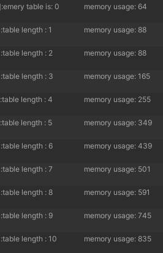

## 10. table 遍历有几种形式 有什么不同

1. 第一种：pairs迭代器

   - 对所有 键值key遍历 通过`next()`函数判断下一个元素

   - 但是会出现随机遍历，可能不会按顺序遍历

   - 也可以用 `tabName.next()` 测试是不是空表

   - ```lua
     tab = {a = "qwe", b = "asd", 3, 2, 1, c = "zxc"}
     for k, v in pairs(tab) do
     	print(k, v)
     end
     tab.d = "qweasd"
     print("添加新索引")
     for k, v in pairs(tab) do
     	print(k, v)
     end
     
     table.remove(tab,"b")
     print("remove索引")
     for k, v in pairs(tab) do
     	print(k, v)
     end
     输出
     a	qwe
     b	asd
     c	zxc
     3	1
     2	2
     1	3
     添加新索引
     a	qwe
     b	asd
     c	zxc
     3	1
     2	2
     1	3
     d	qweasd
     remove索引
     a	qwe
     c	zxc
     3	1
     2	2
     1	3
     d	qweasd
     ```

2. 第二种：ipairs迭代器

   - 遍历数组，顺序遍历，如果中间key有空，则不会遍历后面的

   - ```lua
     tab = {}
     for i= 4,1,-1 do
         tab[i] = i
     end
     tab[6] = "asdqwe"
     for k, v in ipairs(tab) do
     	print(k, v)
     end
     输出
     1	1
     2	2
     3	3
     4	4
     ```
     
     

## 11. 详细描述下项目使用的 class 机制

1. 声明全局变量 `_G["__class"] ` 让C#调用

```lua
if _G["__class"] == nil then
	_G["__class"] = {}	--_class作为index，赋值为一个空表
end
local _class = _G["__class"] or {}
```

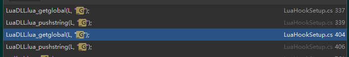

```lua
local rawset = rawset
local setmetatable = setmetatable


-- 输出如果index值是固定结构报错
local function __disable_newindex(t, key, value)
	LogErrorFormat('properties is fix struct, forbid new index (new index：%s value：%s)', key, value)
end
-- 处理新的index
local function __properties_newindex(t, key, value)
	local properties = t.Properties
	if properties[key] == nil then
		rawset(t, key, value)
	else
		properties[key] = value
	end
end
-- 构造函数，如果有父类，则可以再次调用 本构造函数
local function __ctor(obj, class_type, ...)
	if class_type.super then
		__ctor(obj, class_type.super, ...)
	end
	if class_type.ctor then
		class_type.ctor(obj, ...)
	end
end
-- 通过父类来初始化，实现继承
local function __init_super(obj, self_class_type, ...)
	local typeSuper = self_class_type.super
	while typeSuper ~= nil do
		local typeSuperL = typeSuper
		local objSuper = {}
		obj[typeSuper] = objSuper	--将父类设置到这个该对象的 self_class_type.super 索引里
		setmetatable(objSuper, {__index=	-- 设置元表，该被访问时，会调用下列的函数
			function(t, k)
				local ret=_class[typeSuperL][k]	--得到父类的 继承函数
				if type(ret) == "function" then
					local func = ret
					ret = function(self1, ...)
						return func(obj, ...)
					end
					t[k] = ret	-- 如果是函数类型，保存下父类继承函数，没有就nil
				else
					ret = nil
				end
				return ret
			end
		})
		typeSuper = typeSuper.super
	end
end 

function class(super, enable_properties)
       ---@class BaseClass
       local class_type={}	-- class_type 类模板 
       class_type.ctor=false
       class_type.super=super	-- 父类赋值
       class_type.new=function(self_class_type, ...)	-- 定义new成员方法
              local obj= {}
              setmetatable(obj, _class[class_type].__Metatable)
              -- 多重继承调用指定父类方法设定
              __init_super(obj, self_class_type, ...)	-- 调用上面的函数 初始化父类
              __ctor(obj, class_type, ...)			  -- 调用上面的 构造函数
              return obj
       end

       if enable_properties then	
              class_type.new_with_properties = function(self_class_type, properties, ...)
                     local obj= {Properties = properties}
                     local mt = {__index = properties, __newindex = __properties_newindex }	
            	--元表设置索引的时候调用properties，赋值操作table[key] = value调用 __properties_newindex
                    --设置元表
            	setmetatable(obj, mt)
                     setmetatable(properties,  _class[class_type].__PropertiesMetatable)

                     -- 多重继承调用指定父类方法设定
                     __init_super(obj, self_class_type, ...)
                     __ctor(obj, class_type, ...)
                     return obj
              end
       end
    
	-- vtbl可以理解为类容器
       local vtbl=
       {
          __is_class = true,
          is_class_type = function(type)
                 -- 调用函数类型 和 成员表类型 是否相同
                 if class_type == type then
                    	return true
                 end
                 local typeSuper = class_type.super
                 while typeSuper ~= nil do
                        if typeSuper == type then
                           	return true
                        end
                        typeSuper = typeSuper.super
                 end
                 return false
          end,
	--  声明成员变量
          DeclareVar = function(obj, name, value)
             if obj[name] ~= nil then 
                error(string.format("成员变量:%s 已存在，声明失败", name))
                return
             end
             rawset(obj, name, value)
          end
       }

       vtbl.__Metatable =  {__index = vtbl}
       if enable_properties then
          vtbl.__PropertiesMetatable = { __index = vtbl, __newindex = __disable_newindex }
       end

       _class[class_type]= vtbl
	-- 设置 class_type 赋值的时候调用该函数
       setmetatable(class_type,{__newindex=
          function(t,k,v)
             vtbl[k]=v
          end
       })
    
       if super then
        --如果有父类  先从_class中找到父类 父类给vtbl的super赋值
          vtbl.__super = super
        -- 如果没有这个成员，就去父类里面找
          setmetatable(vtbl,{__index=
             function(t,k)
                local ret=_class[super][k]
                vtbl[k]=ret
                return ret
             end
          })
       end
-- 返回类模板，可以添加ctor函数，可以添加成员函数，这些都会被加到vtbl中，
       return class_type
end
```

## 12. 大体 了解下Lua的GC机制

lua 垃圾收集器Garbage Collection   [官网GC相关ppt](https://www.lua.org/wshop18/Ierusalimschy.pdf)

[ lua GC](http://warmcat.org/chai/blog/?p=4233)

1. 哪些对象会被回收

   1. **所有的lua对象都要被回收**（All objects in Lua are subject to garbage  collection）
      1. tables, functions, “modules”, threads
   2. 只保留root set 中 可访问的对象
      1. root set: the registry注册表 and shared metatable 共享元表
      2.  注册表registry 包含 global table (_G),  主线程the main  thread 和`package.loaded`

2. 基础的收集器 是 **标记**`mark` 和 **扫描** `sweep`

   1. GC的流程

      1. 开始->扫描标记 -> 字符串回收 -> 其他GC对象回收 -> 终止
      2. 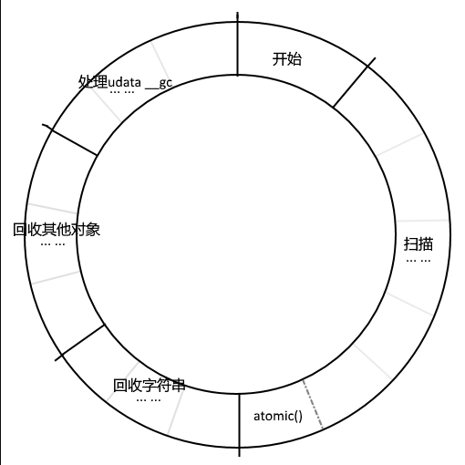
      3. 开始和atomic外，每一步后可以插入用户代码，每次只完成一个子任务

   2. 四个阶段

      1. 开始阶段

         1. root set设置为活跃，root set 由lua可直接访问的对象组成

         2. root包含 mainthread、全局表、注册表、基本类型元表 这4个，在开始阶段设置gray的起点,加入gray链

         3. 一个活跃对象可到达的对象也是活跃的

         4. 当所有活跃对象被标记后，该阶段结束。

         5. ```C
            //c GC初始化，一步完成
            /* mark root set */
            static void markroot (lua_State *L) {
              global_State *g = G(L);
             
              // 1. 清空链表准备这次GC流程
              g->gray = NULL;
              g->grayagain = NULL;
              g->weak = NULL;
             
              // 2. 标记mainthread、全局表、注册表为灰色并加入链表gray
              // 从这几个开始在扫描阶段将它们引用的对象依次遍历
              markobject(g, g->mainthread);
              markvalue(g, gt(g->mainthread));/* make global table be traversed before main stack */
              markvalue(g, registry(L));
              markmt(g); /*基本类型的元方法*/
             
              //GC 切换到扫描阶段
              g->gcstate = GCSpropagate;
            }
            ```

      2. 扫描阶段 ：每个对象都有三种状态之一：白 灰 黑

         1. 白色 ： 未访问过的 （Non-visited objects are marked white）
            1. 对象**创建后的初始标记**，表示还没有进入过标记阶段。
            2. 如果经过扫描后，在**回收阶段还是白色**，表明改对象没有被其他对象引用，进行回收
         2. 灰色：（Visited but not-traversed objects）
            1. 此对象**被扫描过**，且被**其他对象引用**了，
            2. 但这个 对象引用的 其他对象 还没有被扫描过，需要加入gray链等待扫描
         3. 黑色：对象自身以及它引用的对象都已被标记 
            1. 此对象和它直接引用的对象都已经被扫描过，表明这个对象可以从灰链中删除了
               1.  root set的对象都是 黑色 或者 灰色
               2. 黑色对象不能指向 白色 ，灰色对象 是 黑色和白色的分界线
               3. 黑色变成灰色：`for i = 1, N do a[i] = something  end`
               4. 赋值元表 可以让 白色元表 变成 灰色 ： `setmetatable(obj, mt)`
         4. 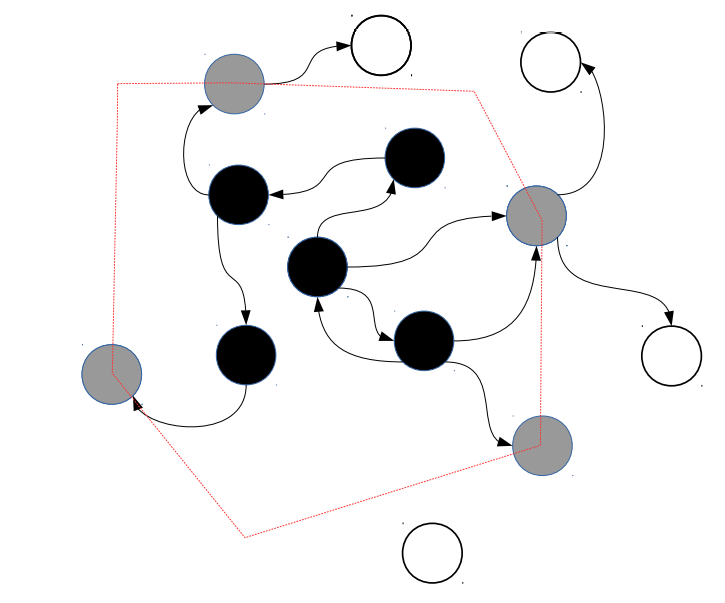
         5. 新建对象的处理：
            1. 如果对象在**GC开始阶段创建**，不需要做特殊处理
            2. 如果一个对象在**GC扫描阶段创建**，且**引用它的对象还在灰链中**，那么不需要做特殊处理
            3. 如果对象在**GC扫描阶段  **且  引用它的对象已经被标记为黑色从灰链中删除，那么要做**向前屏障**，将这个对象从白色标记为灰色加入gray链（引用对象是table除外）
            4. 如果对象在**GC扫描阶段**  且 引用它的**table**已经被标记为黑色从灰链中删除，则做**向后屏障**，将table从黑色重新标记为灰色，加入grayagin链，在后续原子化扫描阶段处理
            5. 如果对象在**GC扫描阶段后创建**，lua采用**双白色机制**，在不同的GC轮次中交替采用不同的白色，只有对象标记为当前白才会被回收，在atomic()函数最后会切换白色，保证新建对象不会在回收阶段被错误回收
         6. **在结果扫描阶段**后，**所有被引用的对象**都会被标记为黑色，**没有被引用的对象**标记为白色。
         7. 回收阶段所有白色的对象会被回收，且回收不影响用户代码执行，能够异步进行。
         8. 扫描阶段的**任务量（开销）**只和活动对象**个数**有关，和分配的内存大小无关。
            1. 比如在某次GC开始前创建了50,000个对象,总共占1GB内存，如果这些对象在扫描开始前大部分都不被引用（非活动的），那么扫描阶段的任务量是很小的，
            2. 但是如果它们大部分都能存活到GC的扫描阶段，那么任务量就会非常大。

      3. 回收阶段

         1. 回收阶段分为回收**字符串**和**其他对象**
         2. 因为字符串存储在`global_State的stringtable`中，而其他对象存储在`root gc`链表中
         3. 回收方式也差别:
            1. 回收字符串每次回收一个桶，回收对象每次回收GCSWEEPMAX个。
            2. 回收对象时，遍历global_State的rootgc链表，对于一个对象
               1. 如果是黑色，将它重新标记为当前白，等待下一轮GC
               2. 如果是白色，将它从rootgc中删除并释放内存

      4. 结束阶段

         1. GC的最后处理userdata的finalize，即释放用户内存，具体方法是调用用户注册的__gc方法，每次处理一个userdata

         2. ```c
            typedef struct global_State {
            	//...
            	lu_byte currentwhite;//当前的白色类型，用于lgc.h>luaC_white()
            	// 当前的GC状态，有5个，在lgc.h定义
            	lu_byte gcstate;  /* state of garbage collector */
            	// strt中字符串散列桶索引，字符串回收阶段每次回收一个散列桶的字符串，记录对应的散列桶索引
            	int sweepstrgc;  /* position of sweep in `strt' */
            	// 所有新建的对象都会暂存在这里，在GC的清理阶段会增量地遍历整个链表。新建对象会加在最*前面*，见luaC_link()
            	GCObject *rootgc;  /* list of all collectable objects */
            	// 保存rootgc中当前回收到的位置，下次从这个位置继续回收
            	GCObject **sweepgc;  /* position of sweep in `rootgc' */
            	// 灰色链表
            	GCObject *gray;  /* list of gray objects */
            	// 需要一次性扫描处理的，不可被打断的对象的灰色链表，比如LUA_THREAD
            	GCObject *grayagain;  /* list of objects to be traversed atomically */
            	// 弱表
            	GCObject *weak;  /* list of weak tables (to be cleared) */
            	// 有__gc方法的userdata，会在GC阶段调用__gc释放native侧的引用。指向链表最后一个
            	GCObject *tmudata;  /* last element of list of userdata to be GC */ // taggedmethodudata带__gc的udata
            	//...
            }
            ```

            

## 13. Lua的全局变量跟local变量的区别，Lua是如何查询一个全局变量的，local的变量的作用域规则是怎么样的？

1. 区别：

   1. 全局变量，存在全局表 ：_G 表中，通过string常量或者string变量作为键来索引全局变量

      1. ```c
         //lauxlib.h
         /* global table */
         #define LUA_GNAME	"_G"
         
         //lapi.c
         /*
         ** Get the global table in the registry. Since all predefined
         ** indices in the registry were inserted right when the registry
         ** was created and never removed, they must always be in the array
         ** part of the registry.
         */
         #define getGtable(L)  \
         	(&hvalue(&G(L)->l_registry)->array[LUA_RIDX_GLOBALS - 1])
         
         LUA_API int lua_getglobal (lua_State *L, const char *name) {
           const TValue *G;
           lua_lock(L);
           G = getGtable(L);
           return auxgetstr(L, G, name);
         }
         
         LUA_API void lua_setglobal (lua_State *L, const char *name) {
           const TValue *G;
           lua_lock(L);  /* unlock done in 'auxsetstr' */
           G = getGtable(L);
           auxsetstr(L, G, name);
         }
         
         /*
         ** get functions (Lua -> stack)
         */
         static int auxgetstr (lua_State *L, const TValue *t, const char *k) {
           const TValue *slot;
           TString *str = luaS_new(L, k);
           if (luaV_fastget(L, t, str, slot, luaH_getstr)) {
             setobj2s(L, L->top, slot);
             api_incr_top(L);
           }
           else {
             setsvalue2s(L, L->top, str);
             api_incr_top(L);
             luaV_finishget(L, t, s2v(L->top - 1), L->top - 1, slot);
           }
           lua_unlock(L);
           return ttype(s2v(L->top - 1));
         }
         ```

   2. local变量，在栈上通过 整数索引获得，最多200个

      1. ```c
         /* maximum number of local variables per function (must be smaller
            than 250, due to the bytecode format) */
         #define MAXVARS		200
         /*
         ** Register a new local variable in the active 'Proto' (for debug
         ** information).
         */
         static int registerlocalvar (LexState *ls, FuncState *fs, TString *varname) {
           Proto *f = fs->f;
           int oldsize = f->sizelocvars;
           luaM_growvector(ls->L, f->locvars, fs->ndebugvars, f->sizelocvars,
                           LocVar, SHRT_MAX, "local variables");
           while (oldsize < f->sizelocvars)
             f->locvars[oldsize++].varname = NULL;
           f->locvars[fs->ndebugvars].varname = varname;
           f->locvars[fs->ndebugvars].startpc = fs->pc;
           luaC_objbarrier(ls->L, f, varname);
           return fs->ndebugvars++;
         }
         /*
         ** Create a new local variable with the given 'name'. Return its index
         ** in the function.
         */
         static int new_localvar (LexState *ls, TString *name) {
           lua_State *L = ls->L;
           FuncState *fs = ls->fs;
           Dyndata *dyd = ls->dyd;
           Vardesc *var;
           checklimit(fs, dyd->actvar.n + 1 - fs->firstlocal,
                          MAXVARS, "local variables");
           luaM_growvector(L, dyd->actvar.arr, dyd->actvar.n + 1,
                           dyd->actvar.size, Vardesc, USHRT_MAX, "local variables");
           var = &dyd->actvar.arr[dyd->actvar.n++];
           var->vd.kind = VDKREG;  /* default */
           var->vd.name = name;
           return dyd->actvar.n - 1 - fs->firstlocal;
         }
         
         ```

2. 如何查询一个全局变量：
   1. ```lua
      a = "*+*+*+*+*+*+*+*+*+*+*+*+*+*+*"
      b = 987654
      c = "123"
      d = pairs
      for k, v in pairs(_G) do
      	print(k,v)
      end
      -- 输出
      -- assert	function: 0xc1
      -- collectgarbage	function: 0xc4
      -- dofile	function: 0xc6
      -- error	function: 0xc8
      -- getmetatable	function: 0xca
      -- ipairs	function: 0xcc
      -- load	function: 0xce
      -- loadfile	function: 0xd0
      -- next	function: 0xd2
      -- pairs	function: 0xd4
      -- pcall	function: 0xd6
      -- print	function: 0x20
      -- rawequal	function: 0xd9
      -- rawget	function: 0xdb
      -- rawlen	function: 0xdd
      -- rawset	function: 0xdf
      -- select	function: 0xe1
      -- setmetatable	function: 0xe3
      -- tonumber	function: 0xe5
      -- tostring	function: 0xe7
      -- type	function: 0xe9
      -- xpcall	function: 0xeb
      -- _G	table: 0x3
      -- _VERSION	Lua 5.3
      -- require	function: 0xe
      -- package	table: 0x7
      -- coroutine	table: 0xf
      -- table	table: 0x10
      -- os	table: 0x11
      -- string	table: 0x12
      -- math	table: 0x14
      -- utf8	table: 0x15
      -- debug	table: 0x16
      -- fengari	table: 0x17
      -- js	table: 0x18
      -- sysLuaStartTimer	function: 0xfa
      -- sysLuaStopTimer	function: 0xfc
      -- json	table: 0x85
      -- @jsTriggerList	table: 0x88
      -- jsTriggerRegister	function: 0x89
      -- log	table: 0x96
      -- gpio	table: 0xa5
      -- adc	table: 0xb0
      -- pwm	table: 0xba
      -- JS_FUNCTION_SYS_RUN	function: 0x105
      -- a	*+*+*+*+*+*+*+*+*+*+*+*+*+*+*
      -- b	987654
      -- c	123
      -- d	function: 0xd4
      ```

3. 作用域规则：（和C语言类似）

   1. 函数内定义局部变量，作用域在函数中。
   2. local定义在文件中，作用域就在文件中
   3. 所有Lua的标准库都是通过**全局变量**暴露给使用者。
   4. 优先权：局部变量覆盖全局变量


## 14. 详细说明元表的机制和它的一些特性

[元表 LuaOS文档](https://wiki.luatos.com/luaGuide/luaReference.html?highlight=%E5%85%83%E8%A1%A8)

元表通过对于某个table定制特定的元方法，来让table拥有 <u>面对非预定义行为的指定解决方法</u> （感觉类似C++运算符重载）

```lua
local t2 = { a = 2 }
local t1 = { a = 1 }
local mt = {
    __add = function(t1, t2)  --元方法
	return t1.a + t2.a 
end
}
function mt:__call(str)  --元方法
	print(str)
end
setmetatable(t1, mt)
setmetatable(t2, mt)
print("__add:", t1 + t2)
t1("11111111qweasdzxc")
t2("222222qweasdzxc")
--输出
-- __add:	3
--11111111qweasdzxc
--222222qweasdzxc
--string
```

- **`__add`:** `+` 操作。 如果任何不是数字的值（包括不能转换为数字的字符串）做加法， Lua 就会尝试调用元方法。 首先、Lua 检查第一个操作数（即使它是合法的）， 如果这个操作数没有为 “`__add`” 事件定义元方法， Lua 就会接着检查第二个操作数。 一旦 Lua 找到了元方法， 它将把两个操作数作为参数传入元方法， 元方法的结果（调整为单个值）作为这个操作的结果。 如果找不到元方法，将抛出一个错误。

- **`__sub`:** `-` 操作。 行为和 “add” 操作类似。

- **`__mul`:** `*` 操作。 行为和 “add” 操作类似。

- **`__div`:** `/` 操作。 行为和 “add” 操作类似。

- **`__mod`:** `%` 操作。 行为和 “add” 操作类似。

- **`__pow`:** `^` （次方）操作。 行为和 “add” 操作类似。

- **`__unm`:** `-` （取负）操作。 行为和 “add” 操作类似。

- **`__idiv`:** `//` （向下取整除法）操作。 行为和 “add” 操作类似。

- **`__band`:** `&` （按位与）操作。 行为和 “add” 操作类似， 不同的是 Lua 会在任何一个操作数无法转换为整数时 尝试取元方法。

- **`__bor`:** `|` （按位或）操作。 行为和 “band” 操作类似。

- **`__bxor`:** `~` （按位异或）操作。 行为和 “band” 操作类似。

- **`__bnot`:** `~` （按位非）操作。 行为和 “band” 操作类似。

- **`__shl`:** `<<` （左移）操作。 行为和 “band” 操作类似。

- **`__shr`:** `>>` （右移）操作。 行为和 “band” 操作类似。

- **`__concat`:** `..` （连接）操作。 行为和 “add” 操作类似， 不同的是 Lua 在任何操作数即不是一个字符串 也不是数字（数字总能转换为对应的字符串）的情况下尝试元方法。

- **`__len`:** `#` （取长度）操作。 如果对象不是字符串，Lua 会尝试它的元方法。 如果有元方法，则调用它并将对象以参数形式传入， 而返回值（被调整为单个）则作为结果。 如果对象是一张表且没有元方法， Lua 使用表的取长度操作（参见 §3.4.7）。 其它情况，均抛出错误。

- **`__eq`:** `==` （等于）操作。 和 “add” 操作行为类似， 不同的是 Lua 仅在两个值都是表或都是完全用户数据 且它们不是同一个对象时才尝试元方法。 调用的结果总会被转换为布尔量。

- **`__lt`:** `<` （小于）操作。 和 “add” 操作行为类似， 不同的是 Lua 仅在两个值不全为整数也不全为字符串时才尝试元方法。 调用的结果总会被转换为布尔量。

- **`__le`:** `<=` （小于等于）操作。 和其它操作不同， 小于等于操作可能用到两个不同的事件。 首先，像 “lt” 操作的行为那样，Lua 在两个操作数中查找 “`__le`” 元方法。 如果一个元方法都找不到，就会再次查找 “`__lt`” 事件， 它会假设 `a <= b` 等价于 `not (b < a)`。 而其它比较操作符类似，其结果会被转换为布尔量。

- **`__index`:** 索引 `table[key]`。 当 `table` 不是表或是表 `table` 中不存在 `key` 这个键时，这个事件被触发。 此时，会读出 `table` 相应的元方法。

  尽管名字取成这样， 这个事件的元方法其实可以是一个函数也可以是一张表。 如果它是一个函数，则以 `table` 和 `key` 作为参数调用它。 如果它是一张表，最终的结果就是以 `key` 取索引这张表的结果。 （这个索引过程是走常规的流程，而不是直接索引， 所以这次索引有可能引发另一次元方法。）

- **`__newindex`:** 索引赋值 `table[key] = value` 。 和索引事件类似，它发生在 `table` 不是表或是表 `table` 中不存在 `key` 这个键的时候。 此时，会读出 `table` 相应的元方法。

  同索引过程那样， 这个事件的元方法即可以是函数，也可以是一张表。 如果是一个函数， 则以 `table`、 `key`、以及 `value` 为参数传入。 如果是一张表， Lua 对这张表做索引赋值操作。 （这个索引过程是走常规的流程，而不是直接索引赋值， 所以这次索引赋值有可能引发另一次元方法。）

  一旦有了 “newindex” 元方法， Lua 就不再做最初的赋值操作。 （如果有必要，在元方法内部可以调用 `rawset` 来做赋值。）

- **`__call`:** 函数调用操作 `func(args)`。 当 Lua 尝试调用一个非函数的值的时候会触发这个事件 （即 `func` 不是一个函数）。 查找 `func` 的元方法， 如果找得到，就调用这个元方法， `func` 作为第一个参数传入，原来调用的参数（`args`）后依次排在后面。

## 15. lua 那些情况会产生 垃圾回收

1. 被动触发：
   1. 周期性的自动进行 （从C语言源码看，GCdept大于0时，就会触发自动GC）
   2. 堆上的内存不足时触发
2. 主动触发：
   1. 主动调用collectgarbage(“collect”)

```c
/*
** Does one step of collection when debt becomes positive. 'pre'/'pos'
** allows some adjustments to be done only when needed. macro
** 'condchangemem' is used only for heavy tests (forcing a full
** GC cycle on every opportunity)
*/
#define luaC_condGC(L,pre,pos) \
	{ if (G(L)->GCdebt > 0) { pre; luaC_step(L); pos;}; \
	  condchangemem(L,pre,pos); }
/* more often than not, 'pre'/'pos' are empty */
#define luaC_checkGC(L)		luaC_condGC(L,(void)0,(void)0)

/*
** Union of all Lua values
*/
typedef union Value {
    struct GCObject *gc;    /* collectable objects */
    void *p;         /* light userdata */
    lua_CFunction f; /* light C functions */
    lua_Integer i;   /* integer numbers */
    lua_Number n;    /* float numbers */
} Value;
```

## 16. C# 不想让外部使用new的方式 生成对象，有什么办法？

经典单例模式，private 化构造函数，在类内部函数，new出来对象，调用构造函数

同一时间内只允许一个实例对某些数据进行操作

```c#
    public class ObjectClass
    {
        private static ObjectClass singleton;
        private ObjectClass()
        {
        }

        public static ObjectClass GetSingletone()
        {
            if (singleton == null)
            {
                singleton = new ObjectClass();
            }
            return singleton;
        }
    }
```

## 17. 非运行时的代码比如OnDrawGizmos 里面 new出来的资源，删除时机的隐患是什么（注意不加编辑器运行的属性，OnDisable，OnDestroy是不会执行的）

OnDrawGizmos 在程序一运行就执行 ,每帧都运行

```c#
using System.Collections;
using System.Collections.Generic;
using UnityEngine;
public class OnDeawGizmosObject : MonoBehaviour
{
    private void OnDrawGizmos()
    {
        Gizmos.DrawWireSphere(Vector3.zero, 10);
        GameObject go = new GameObject();
    }
}
```

因为不会调用`OnDisable  OnDestroy` 所以流程可能出现问题，需要手动`Destory`不然可能造成内存泄漏

并且如果有在最后`OnDisable  OnDestroy` 流程中，保存数据，传递数据等操作，会失效

## 18. 什么是lua的尾调用，它有什么作用？

[函数尾调用](https://hypc-pub.github.io/lua-tutorial/chapter06/tail_calls.html)

1. 尾调用是一种类似在函数结尾的`goto`调用，当函数最后一个动作是调用另外一个函数时，我们称这种调用尾调用。

   1. ```lua
      function f()
          return g()
      end
      ```

   2. `f`调用`g`后不会再做任何事情，这种情况下当被调用函数`g`结束时程序不需要返回到调用者`f`； 所以尾调用之后程序不需要在栈中保留关于调用者的任何信息。

2. 尾调用**不需要使用栈空间**，那么尾调用递归的层次可以无限制的。

   1. ```lua
      function foo(n)
          if n > 0 then return foo(n - 1) end
      end
      ```

3. 正确的尾调用：需要做完f调用g不再做任何事情，错误的尾调用会创建一个栈，多次调用后可能导致**栈溢出**

   1. ```lua
      function f(x)
          g(x)
          return
      end
      return g(x) + 1         -- must do the addition
      return x or g(x)        -- must adjust to 1 result
      return (g(x))           -- must adjust to 1 result
      ```

## 19. 评估Lua字符串拼接的消耗，有没效率更高的拼接方式

```lua
--加载sys库
sys = require("sys")

function operatorConcat()
    local str  = "string"
    for i = 1, 100000 do
        str  = str  .. "a"
    end
end
function formatConcat()
	local result = "string"
	for i = 1, 100000 do
		result = string.format("%s%s", result, "a")
	end
end
function tableConcat()
    local t = {}
    for i = 1, 100000 do
        table.insert(t,"string")
    end
    table.concat(t)
end
local startTime = os.clock()
operatorConcat()
print("operatorConcat cost time:", os.clock() - startTime)

startTime = os.clock()
formatConcat()
print("formatConcat cost time:", os.clock() - startTime)

startTime = os.clock()
tableConcat()
print("tableConcat cost time:", os.clock() - startTime)

输出：
operatorConcat cost time:	3.4745999999577
formatConcat cost time:	11.608300000022
tableConcat cost time:	0.42940000002272
```

| 方式         | 时间             |
| ------------ | ---------------- |
| ..           | 3.4745999999577  |
| format       | 11.608300000022  |
| table.concat | 0.42940000002272 |


## 20. lua 表的2种初始化方式：哪种性能高 差多少 ？ 为什么？
1. ```lua
    for i = 1, 1000000 do
    	local a ={}
     	a[1] =1; a[2] =2; a[3] =3
    end
    ```
    
2. ```lua
    for i = 1, 1000000  do
    	local a = {true,true,true}
    	a[1] =1; a[2] =2; a[3] =3
    end
    ```
    

一眼第二种要开辟内存，耗时肯定高
```lua
function first( ... )
    for i = 1, 1000000 do
        local a ={}
        a[1] =1; a[2] =2; a[3] =3
    end
end
function second( ... )
    for i = 1, 1000000  do
        local a = {true,true,true}
        a[1] =1; a[2] =2; a[3] =3
    end
end
local startTime = os.clock()
first()
print("fitst cost time:", os.clock() - startTime)

startTime = os.clock()
second()
print("second cost time:", os.clock() - startTime)

输出：
fitst cost time:	0.7533000000119
second cost time:	0.92859999996426
```
| 方式         | 时间             |
| ------------ | ---------------- |
| fitst cost time:       | 0.7533000000119  |
| second cost time:       | 0.92859999996426  |


## 21. 测试一下以下2种代码的性能差异
1. ```lua
    for i = 1, 1000000 do
    	local x =math.sin(i)
    end
    ```

2. ```lua
    local sin = math.sin
    for i = 1, 1000000 do　　
        local x = sin(i)
    end
    ```

```lua
function first( )
    for i = 1, 1000000 do
        local x = math.sin(i)
    end
end
function second( )
    local sin = math.sin
    for i = 1, 1000000 do
        local x = sin(i)
    end
end
local startTime = os.clock()
first()
print("fitst cost time:", os.clock() - startTime)
startTime = os.clock()
second()
print("second cost time:", os.clock() - startTime)
-- 输出
-- fitst cost time:	0.84560000002375
-- second cost time:	0.6414000000359
```
第一种需要多次取hash，mash.sin,这个点的性能消耗
| 方式         | 时间             |
| ------------ | ---------------- |
|fitst cost time:	|0.84560000002375|
|second cost time:	|0.6414000000359|

## 22. local 变量的访问，在函数中定义直接访问和在文件中定义 性能上有何区别？

[高性能 Lua 技巧](https://segmentfault.com/a/1190000004372649)

直接回答：

1. 函数中直接访问local变量，是在函数的自己的寄存器上（lua虚拟机）一个数组+索引实现。
2. 文件定义中访问local变量，需要取到文件的table中取hash，从中获得文件中的局部变量。

1. 预编译时便能将所有的局部变量存到寄存器中。所以，在 Lua 中访问局部变量是很快的

2. 每个函数都有其自己的寄存器。由于每条指令只有 8 个 bit 用来指定寄存器，每个函数便可以使用多至 250 个寄存器。

3.  如果 `a` 和 `b` 是局部变量，语句 `a = a + b` 只生成一条指令：`ADD 0 0 1`（假设 `a` 和 `b` 分别在寄存器 `0` 和 `1` 中）。对比之下，如果 `a` 和 `b` 是全局变量，生成上述加法运算的指令便会如下：

   1. ```assembly
      GETGLOBAL    0 0     ; a
      GETGLOBAL    1 1     ; b
      ADD          0 0 1
      SETGLOBAL    0 0     ; a
      ```

```lua
--函数内局部变量
function localFunctionVariable( )
    local startTime = os.clock()
    local localVariable = 1
    for i = 1, 1000000 do
        localVariable = localVariable + 1
    end
    print("函数中local变量访问 cost time:", os.clock() - startTime, localVariable)
end
-- 文件内局部变量
local localFileVariable = 1
function localFile( )
    local startTime = os.clock()
    for i = 1, 1000000 do
        localFileVariable = localFileVariable + 1
    end
    print("文件中local变量访问 cost time:", os.clock() - startTime,localFileVariable)
end
-- 全局变量
globalVaribal = 1
function global( )
    local startTime = os.clock()
    for i = 1, 1000000 do
        globalVaribal = globalVaribal + 1
    end
    print("全局变量访问 cost time:", os.clock() - startTime, globalVaribal)
end

localFunctionVariable()
localFile()
global()

--输出
--函数中local变量访问 cost time:	0.19130000001132	1000001
--文件中local变量访问 cost time:	0.24780000001192	1000001
--全局变量访问 cost time:		0.30239999997502	1000001
```

| 方式            | 时间             |
| --------------- | ---------------- |
| 函数中local变量 | 0.19130000001132 |
| 文件中local变量 | 0.24780000001192  |
| 全局变量        | 0.30239999997502  |
